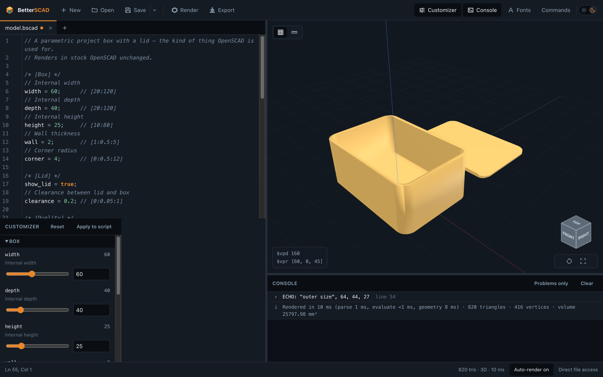
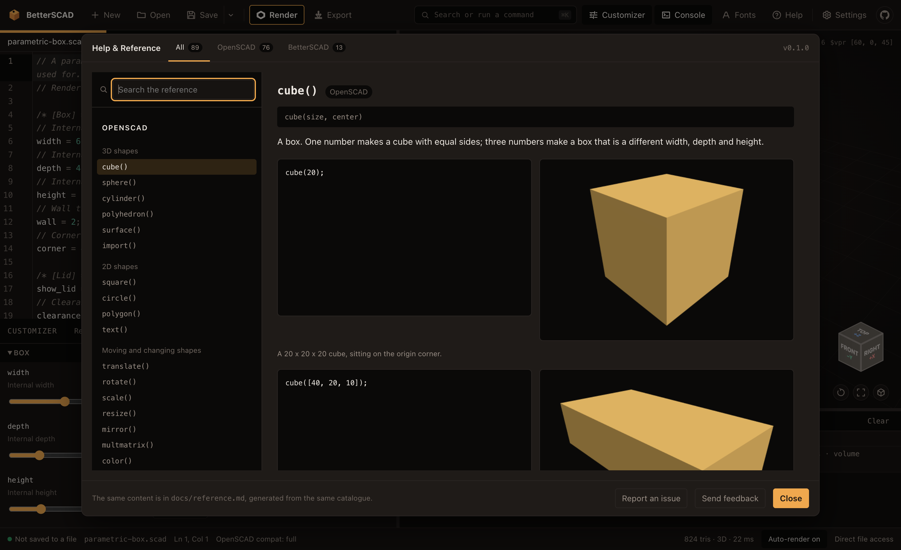
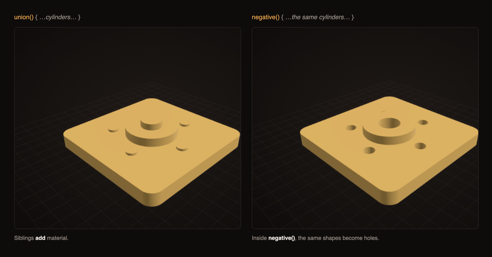
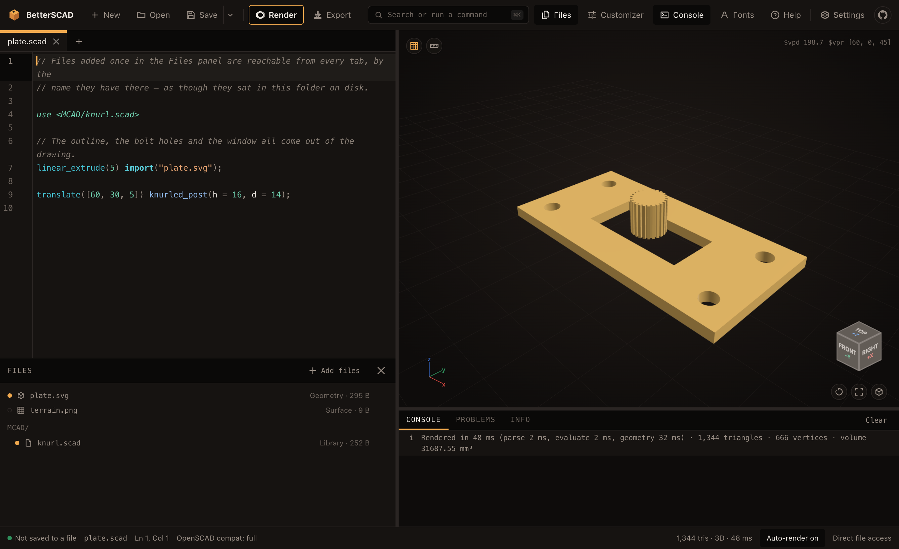

<div align="center">

<picture>
  <source media="(prefers-color-scheme: dark)" srcset="brand/betterscad-logo-dark.svg">
  <source media="(prefers-color-scheme: light)" srcset="brand/betterscad-logo-light.svg">
  
</picture>

**A modern, local-first CAD editor for the browser — fully compatible with OpenSCAD.**

Write parametric models in the OpenSCAD language, see them render instantly, and export
to STL, 3MF, OFF, AMF, SVG or DXF. Everything runs on your machine. There is no server,
no account, and nothing is uploaded.

### [→ Try it in your browser](https://betterscad.org)

No install, no sign-up. It loads a starter model you can edit straight away.

[Quick start](#quick-start) · [Reference](docs/reference.md) · [What's new in the language](#language-extensions) · [CLI](#command-line) · [Contributing](#contributing)

<br>



</div>

---

## What it is

A CAD editor for the browser that speaks OpenSCAD. Open an existing `.scad` file
and it renders unmodified — the whole language is there, not a subset.

It also adds a few things OpenSCAD doesn't have, under one rule: **every addition
has a defined way back to plain `.scad`**, so nothing you write here can strand
you.

## Features

| | |
| --- | --- |
| **Runs on your machine** | No server, no account. Your models never leave the browser. |
| **Full OpenSCAD language** | Existing `.scad` files open and render unchanged. |
| **Real files** | Opens and saves straight to disk, with a download/upload fallback on Firefox and Safari. |
| **Live customizer** | Sliders and dropdowns generated from your `//` parameter comments. |
| **Modern editor** | Syntax highlighting, autocomplete with every call form, suggested values for arguments that take a fixed set, the signature kept on screen while you fill a call in, tabs, inline errors. |
| **Type in inches** | `5in` becomes `127` as you type. The file stays in millimetres — see below. |
| **Built-in reference** | Every element of the language explained plainly, with a rendered example of each. `F1`, or the Help button. |
| **Preview and render** | `F5` previews, `F6` renders what Export writes. Auto-render keeps up as you type. |
| **Exports** | STL, 3MF, OFF, AMF for 3D; SVG and DXF for 2D; and plain `.scad`. |
| **Imports** | STL, OBJ, OFF, DXF, SVG, and heightmaps via `surface()`. |
| **Project files** | Add images, drawings, meshes, fonts and libraries once; every tab reaches them by name, as though they sat in the same folder. |
| **Fonts for `text()`** | Name a font and it loads itself — ~50 Google Fonts, the ones installed on your machine, or a file of your own. Every one previewed in its own typeface. |
| **CAD navigation** | Turntable orbit with a corner view cube — click a face to snap to it, or drag it to orbit. |
| **Measurement** | Click points in the viewport for coordinates and distances. |
| **Animation** | `$t` playback in the app, frame export from the CLI. |
| **Works offline** | Installable, and fully functional with no network. |
| **Headless CLI** | `bscad model.scad -o model.stl`, for batch jobs and CI. |

## Reference

Every element of the language — the whole of OpenSCAD, plus everything BetterSCAD
adds — written for someone who has never used CAD, with a rendered example of
each. **[Read it here](docs/reference.md)**, or press `F1` in the app.



The document and the app's Help view are generated from one catalogue, along with
every screenshot in them, so they cannot disagree with each other or with the
engine.

## Quick start

Nothing to install — [open it in your browser](https://betterscad.org). First run
offers a sample model, a blank file, or a file from your disk.

To run it locally:

```sh
git clone https://github.com/theanam/betterScad.git
cd betterScad
npm install
npm run dev          # http://localhost:5174
npm run build        # static site in packages/app/dist — serve it anywhere
```

## Language extensions

Everything OpenSCAD has, plus the following. Save as OpenSCAD `.scad` and these
are rewritten automatically. The console's **Info** tab lists what a file uses
and the lines it appears on, and previews the `.scad` it will become.

### `negative()` — turn anything into negative space

Wrap a shape in `negative()` and it stops being material and starts being a hole.
It gets carved out of everything else in the same scope, so holes can sit next to
the thing they go through instead of being hoisted into a `difference()` at the
top of the file.



```scad
union() {
  plate();
  boss();

  negative() {              // carved out of BOTH plate() and boss()
    translatez(-1) cylinder(h = 20, r = 5);
    for (i = [0:4]) rotatez(i * 72) translate(18, 0, -1) cylinder(h = 20, r = 2.5);
  }
}
```

"The same scope" means the enclosing `{ … }`, module body, or top level — a
negative never reaches further than the braces it was written in.

### Everything else

| Syntax | What it does | Becomes, in plain `.scad` |
| --- | --- | --- |
| `negative() { … }` | Turns anything inside it into negative space | `difference()` around the scope |
| `cube(size, center, r)`<br>`square(size, center, r)` | The same box and rectangle, with a radius on the edges. `r = 0` is the stock shape | A hull of corner spheres or circles |
| `cylinder(…, chamfer)`<br>`chamfer1`, `chamfer2`, `edge_style` | Takes the rim off either end — cut flat by default, or `edge_style = "round"`. `1` is the bottom and `2` the top, as with `r1`/`r2` | A revolve of the same profile |
| `text(…, radius)`<br>`start`, `facing` | Runs the writing around a circle instead of a straight line, spaced by real letter widths | Per-glyph `text()` calls, with the widths measured into the file |
| `regular_polygon(sides, length)` | An equilateral polygon — say the side length, not the radius | `circle()` at the matching radius, with `$fn = sides` |
| `thread(d, pitch, h)` | A screw thread. Add `internal = true` for the hole the same bolt screws into | A generated module sweeping the profile up a twisted extrusion |
| `translate(x, y, z)`<br>`rotate(x, y, z)`<br>`mirror(x, y, z)` | Loose numbers, for when the brackets are just noise | `translate([x, y, z])`, and so on |
| `translatex(d)`<br>`translatey(d)`<br>`translatez(d)` | Move along one axis | `translate([d, 0, 0])`, and so on |
| `rotatex(a)`<br>`rotatey(a)`<br>`rotatez(a)` | Turn about one axis | `rotate([a, 0, 0])`, and so on |
| `mirrorx()`<br>`mirrory()`<br>`mirrorz()` | Flip across one plane | `mirror([1, 0, 0])`, and so on |
| `for (i = 0; i < n; i = i + 1)` | A C-style loop as a statement | A range `for` with the condition as a guard |
| `is_range(x)` | Tests for a range, like the other `is_*` functions | ⚠️ Nothing — it becomes `undef` in stock OpenSCAD |

Stock syntax is untouched: `rotate(a, v)` is still the axis rotation it always
was. The shapes get a generated module in the exported file — defined once and
called, so the export reads like what you wrote.

Every one of these, and every element of OpenSCAD itself, is written up with a
rendered example in [`docs/reference.md`](docs/reference.md) — the same content
the app shows under **Help** (`F1`). The implementation details are in
[`docs/language.md`](docs/language.md).

## Type in inches, keep a millimetre file

OpenSCAD has no units. Every number is a millimetre by convention, and the whole
ecosystem — printers, slicers, hardware tables — agrees. That leaves anyone
working from an imperial drawing doing arithmetic in their head, or scattering
`* 25.4` through the file, which is a thing to get wrong once and then never
notice again.

So the editor does the arithmetic. Type a measurement with a unit on it and it
converts the moment you finish the number:

```scad
plate = 6in;          ->  plate = 152.4;
bore  = 0.25inch;     ->  bore  = 6.35;
rod   = 1.5 inches;   ->  rod   = 38.1;
```

`in`, `inch` and `inches` all work, with or without a space. Nothing converts
until the measurement is finished — `5in` is also the first three characters of
`5inch` — so it waits for whatever you type next to end it: a comma, a bracket,
a semicolon, a newline.

**What lands in the file is a plain number.** This is an editor convenience and
nothing more: no unit is stored, nothing in the saved model depends on it, and a
file written this way opens in OpenSCAD with no idea it was ever typed in
inches. The converted number flashes briefly so you can see it happen, and a
single undo puts your `5in` back if you wanted the letters.

Off by default for nobody — it is on, and there is a switch in **Settings** if
you would rather it were not.

## Settings

The gear in the toolbar holds the handful of things the app asks rather than
assumes. None of them changes what a saved file means.

| | |
| --- | --- |
| **Theme** | Light or dark. |
| **Round dimensions** | Whether autocomplete offers `cylinder(h, d)` or `cylinder(h, r)` first. Both are right; people are firmly one or the other. |
| **Inch entry** | The conversion above. |
| **Tab completion** | Tab takes the open suggestion. With none open it indents, as it always did. |
| **Auto-render** | Re-render as you type, or only on `F5`. |
| **Indent** | Two spaces or four. |

## Project files

A model that says `import("bracket.stl")` needs a folder to find it in, and a
browser has none. The **Files** panel is that folder: add a file once and every
open tab can name it, exactly as it would on disk.



Drop files anywhere in the window, or use **Add files**. What goes in there:

| | Used by |
| --- | --- |
| `.png` `.jpg` `.dat` | `surface("terrain.png")` |
| `.svg` `.dxf` `.stl` `.obj` `.off` `.3mf` | `import("logo.svg")` |
| `.scad` `.bscad` | `use <MCAD/gears.scad>`, `include <…>` |
| `.ttf` `.otf` `.ttc` | `text("Hi", font = "Orbitron")` |

Folders work, and so does a bare name: `use <MCAD/gears.scad>` finds a file you
added as `gears.scad`. A library can be opened in a tab to edit — the tab is
then what your model renders against, and Save puts it back.

The files are kept in your browser, so they are still there after a reload.
Nothing is uploaded, here as everywhere else.

### Save as `.zip`

Once a model uses a project file, the Save menu offers **Save as `.zip`**: the
model plus every file it actually used, laid out so the paths in the script
resolve as they stand. Unzip it and it opens in OpenSCAD.

What goes in is what the render resolved, not what the text mentions — a library
three levels down an `include` chain is in, an `import` inside an `if` that never
ran is not.

Opening a `.zip` does the reverse: models at the top level become tabs and
everything else joins the Files panel.

Fonts are the one thing a zip cannot fully deliver. `text(font = "Orbitron")`
names a family, and OpenSCAD looks for families in its own font path rather than
beside the file. The font travels in `fonts/` with a note saying so.

## File formats

`.bscad` is the native format, and it *is* a `.scad` file — the extras (panel
layout, customizer presets, camera) live in a leading comment, so OpenSCAD opens
it unchanged.

Saving follows the extension: a `.bscad` keeps its extras, a `.scad` is saved as
plain source. **Save ▸ Save as OpenSCAD `.scad`** is the guaranteed-portable
version; it tells you what it will change, and a file that needs no changes is
saved byte for byte.

Opening a `.scad` that uses the extensions above warns you, naming the lines.

## Command line

```sh
bscad model.scad -o model.stl               # render to STL
bscad model.scad -D size=30 -D label='"v2"' # override parameters
bscad *.scad -f 3mf -o build/               # batch render
bscad anim.scad --frames 60 -o frames/      # animation frames
bscad model.bscad --legacy-scad -o out.scad # convert to plain OpenSCAD
bscad model.scad --strict                   # treat warnings as errors, for CI
```

## Browser support

| | Rendering | Direct file save | System fonts |
| --- | --- | --- | --- |
| Chrome / Edge | ✅ | ✅ | ✅ |
| Firefox | ✅ | Download / upload | Load font files |
| Safari | ✅ | Download / upload | Load font files |

Needs WebAssembly and WebGL2 — anything from roughly 2021 onwards.

## Status

Early but real: the language is complete, the app is usable, and the engine is
covered by tests. Not there yet:

- **Third-party libraries** (BOSL2, MCAD) are untested and unsupported.
- **Desktop builds** are scaffolded but not yet built — see [`docs/desktop.md`](docs/desktop.md).
- **A persistent library** of your own parts and snippets. Multi-file tabs and
  `include`/`use` across them already work.
- **`surface()` with image heightmaps** works in the browser but not in the CLI.

## Analytics

[betterscad.org](https://betterscad.org) counts page views with Google Analytics.
Nothing about your models is sent — no source, no geometry, no file names. Builds
you make yourself carry no analytics at all; the tag is added only by the deploy
workflow.

## Deploying

The site is fully static: `npm run build`, then serve `packages/app/dist`
anywhere. For GitHub Pages, [`.github/workflows/deploy.yml`](.github/workflows/deploy.yml)
publishes on every push to `main` with no repo settings to change.

The build has no fixed base URL — one `dist/` works from a domain root, from a
Pages project path and from `file://` in the desktop shell. The few tags that
*must* be absolute (`<link rel="canonical">`, the Open Graph image, the sitemap)
are therefore generated from `packages/app/public/CNAME`, which is the address
the site is actually served under. Point that file at your own domain and they
follow it; delete it and they are simply omitted, rather than pointing search
engines at ours and declaring your deployment a duplicate. `BETTERSCAD_SITE_URL`
overrides it if you serve from a path rather than a domain root.

## Contributing

Issues and pull requests welcome. Four non-negotiable rules:

1. **Any new language syntax ships with its plain-`.scad` downgrade**,
   implemented in [`transpile.ts`](packages/engine/src/transpile.ts) and covered
   by a test proving the rewrite is equivalent.
2. **The export has to read like the file that produced it.** A one-liner is
   rewritten in place; anything bigger becomes a generated module, defined once
   and called wherever the shape was used. Generated code is code someone will
   open.
3. **Any new element is documented before it ships.** Add it to the catalogue in
   [`packages/app/src/reference/`](packages/app/src/reference/) with a worked
   example, then run `npm run reference`. That renders its screenshot and
   regenerates [`docs/reference.md`](docs/reference.md), and the app's Help view
   picks it up from the same file. An element that is not in the reference is
   not finished, and CI fails if the reference is out of date.
4. **Every change moves the version**, by semver:
   - **minor** — anything a user can see in the editor, the language, or an
     extension: a new element, a new panel, a changed behaviour.
   - **patch** — a release that adds no capability: fixes, docs, chores.
   - **major** — a break in the language or in the file format, once there is a
     1.0 to break from. Below 1.0 semver puts those in **minor**, and so does
     this project: `cube(r)` replacing `rounded_cube()` is a 0.2 → 0.3.

   Run `npm run bump -- minor` (or `patch`, `major`). The number lives in eleven
   places — five manifests, a literal in the engine's API, and the lock file —
   so it is never edited by hand, and `npm run version:check` fails CI when any
   of them drifts.

```sh
npm run typecheck
npm test
npm run build
npm run reference          # after adding or changing any element
npm run bump -- minor      # or patch; never edit a version by hand
npm run screenshot         # retakes the README's app screenshots, needs `npm run dev`
```

How it all fits together: [`docs/architecture.md`](docs/architecture.md).

## Licence

[MIT](LICENSE).

The engine is written from scratch; no code is derived from the OpenSCAD project.
That is what makes the MIT licence possible — the CSG kernel is
[Manifold](https://github.com/elalish/manifold) (Apache-2.0) rather than CGAL.
Also uses [Three.js](https://threejs.org), [CodeMirror](https://codemirror.net)
and [opentype.js](https://opentype.js.org) (all MIT); bundled fonts are OFL-1.1.

Brand assets and tokens live in [`brand/`](brand/).
