<!-- Generated by `npm run reference` from packages/app/src/reference/. Do not edit. -->

# Reference

Every element of the language, explained plainly, with a picture of what each one makes.

This is the same content as the app’s **Help & Reference** view — the button between Fonts and the theme switch, or `F1` from anywhere. The two are generated from one catalogue, so they cannot disagree.

Screenshots are rendered by the engine itself, from the code shown beside them. Where a faint grey ghost appears, that is the "before" — a `%` shape marking where the solid started.

**Only want what BetterSCAD adds?** Jump to [BetterSCAD additions](#betterscad-additions) — 13 entries, each saying what it becomes when you save as plain `.scad`.

**OpenSCAD** — [3D shapes](#3d-shapes) · [2D shapes](#2d-shapes) · [Moving and changing shapes](#moving-and-changing-shapes) · [Combining shapes](#combining-shapes) · [Between 2D and 3D](#between-2d-and-3d) · [Writing a model](#writing-a-model) · [Repeating and choosing](#repeating-and-choosing) · [Modifier characters](#modifier-characters) · [Special variables](#special-variables) · [Maths](#maths) · [Lists and text](#lists-and-text) · [Checking types](#checking-types) · [Output and checks](#output-and-checks)

**BetterSCAD additions** — [Shapes](#shapes) · [Negative space](#negative-space) · [Transforms without the brackets](#transforms-without-the-brackets) · [Language](#language) · [Getting back to plain OpenSCAD](#getting-back-to-plain-openscad)

---

# OpenSCAD

The whole OpenSCAD language, which BetterSCAD implements in full. Every file that uses only what is on this page opens unchanged in OpenSCAD itself.

## 3D shapes

The five solids everything else is built from.

<a id="entry-cube"></a>

### cube()

```
cube(size, center)
```

A box. One number makes a cube with equal sides; three numbers make a box that is a different width, depth and height.

```scad
cube(20);
```


*A 20 x 20 x 20 cube, sitting on the origin corner.*

```scad
cube([40, 20, 10]);
```

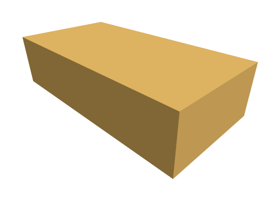

*Different on each axis: 40 wide, 20 deep, 10 tall.*

```scad
%cube(20);
cube(20, center = true);
```

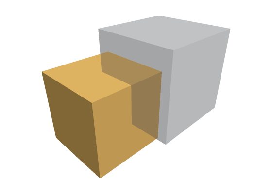

*The ghost is the default position; the solid is the same cube with `center = true`.*

| Argument | |
| --- | --- |
| `size` | Number, or `[x, y, z]`. Default `1`. |
| `center` | `true` centres the box on the origin. Default `false`. |
| `r` | BetterSCAD: radius on every edge. Default `0`, which is the stock cube. |

`size` is a number, or `[x, y, z]`. It defaults to `1`.

By default the box sits in the corner between the three axes, with one corner on the origin and the whole thing in positive X, Y and Z. `center = true` moves it so the origin is in the middle instead — which is usually what you want when you are about to rotate it, because a shape rotates around the origin, not around itself.

A size of zero or less on any axis produces nothing, and reports a warning.

BetterSCAD adds a third argument, `r`, which rounds every edge. It sits after `center` so that `cube(10, true)` keeps its meaning. See its own entry for the detail.

See also: [`cube(r), square(r)`](#entry-shape-radius) · [`sphere()`](#entry-sphere) · [`cylinder()`](#entry-cylinder)

<a id="entry-sphere"></a>

### sphere()

```
sphere(r | d)
```

A ball, centred on the origin. Say how big with `r` (the radius — the distance from the middle to the surface) or `d` (the diameter — all the way across).

```scad
sphere(12);
```

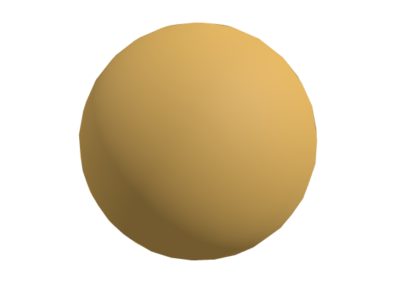

*A ball of radius 12, at default resolution.*

```scad
sphere(12, $fn = 8);
translate([30, 0, 0]) sphere(12, $fn = 24);
translate([60, 0, 0]) sphere(12, $fn = 96);
```

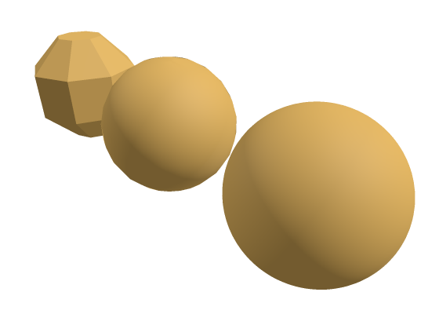

*The same ball at `$fn = 8`, `24` and `96`. Only the last one looks round.*

| Argument | |
| --- | --- |
| `r` | Radius. Default `1`. |
| `d` | Diameter. Overrides `r`. |
| `$fn / $fa / $fs` | Resolution. See the special variables. |

A sphere is not really round: it is a many-sided shape that gets closer to round the more sides you allow. `$fn`, `$fa` and `$fs` control how many. The default settings are deliberately coarse so that editing stays fast; raise `$fn` before you export.

`d` wins if you pass both. `r` defaults to `1`.

The sphere is always centred on the origin — there is no `center` argument, because there is nothing else it could mean.

See also: [`$fn`](#entry-fn) · [`cylinder()`](#entry-cylinder)

<a id="entry-cylinder"></a>

### cylinder()

```
cylinder(h, r | r1, r2 | d, d1, d2, center)
```

A tube or a cone. Give it a height and a radius for a tube; give it a different radius at each end and it becomes a cone, or a cone with its tip cut off.

```scad
cylinder(h = 30, r = 10);
```

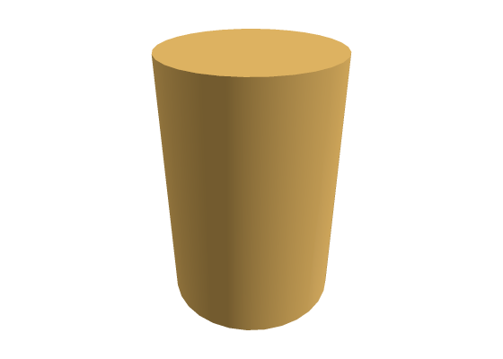

*A plain round rod.*

```scad
cylinder(h = 30, r1 = 14, r2 = 0);
```

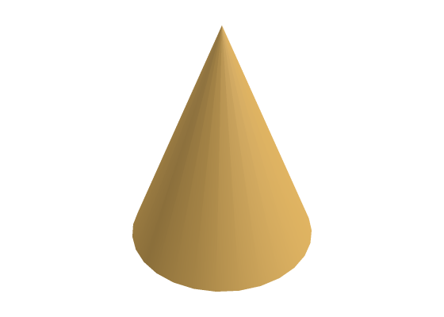

*A radius of `0` at the top gives a cone.*

```scad
cylinder(h = 10, r = 12, $fn = 6);
```

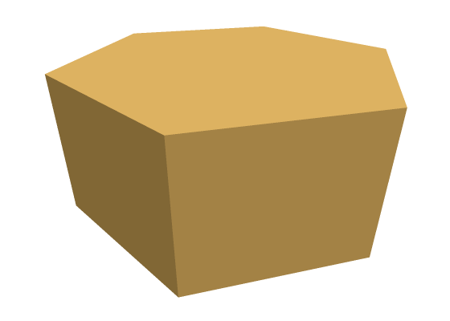

*`$fn = 6` turns the same call into a hexagon — a nut pocket.*

| Argument | |
| --- | --- |
| `h` | Height. Default `1`. |
| `r` | Radius, both ends. |
| `r1 / r2` | Bottom and top radius. |
| `d / d1 / d2` | Diameter forms. These win over the radius forms. |
| `center` | `true` centres the height on the origin. Default `false`. |
| `fillet` | BetterSCAD: eases both ends. `fillet1` / `fillet2` take the bottom and top, and `fillet_style` is `"round"` or `"chamfer"`. |

`r` sets both ends. `r1` is the bottom and `r2` the top; `d`, `d1` and `d2` are the diameter versions and win over the radius ones. Set one end to `0` for a proper pointed cone.

By default the cylinder stands on the XY plane and grows upward. `center = true` puts the middle of its height on the origin, so it runs from `-h/2` to `+h/2`.

Like a sphere, it is really a many-sided prism. With `$fn = 6` you get a clean hexagonal rod, which is a genuinely useful thing to want — nut pockets and hex shafts are usually drawn this way.

`h` defaults to `1`, and a height of zero or less produces nothing.

BetterSCAD adds `fillet`, which takes the sharp rim off either end. See its own entry for the detail.

See also: [`cylinder(fillet)`](#entry-cylinder-fillet) · [`sphere()`](#entry-sphere) · [`$fn`](#entry-fn) · [`rotate_extrude()`](#entry-rotate_extrude)

<a id="entry-polyhedron"></a>

### polyhedron()

```
polyhedron(points, faces, convexity)
```

A shape you describe corner by corner. You list every corner, then list which corners make up each flat face. It is the escape hatch for shapes nothing else can make.

```scad
polyhedron(
  points = [[0, 0, 0], [20, 0, 0], [20, 20, 0], [0, 20, 0], [10, 10, 22]],
  faces  = [[0, 1, 4], [1, 2, 4], [2, 3, 4], [3, 0, 4], [3, 2, 1, 0]]
);
```

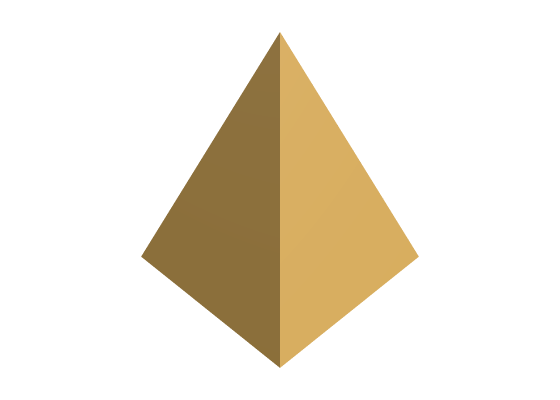

*A square pyramid: four corners on the ground, one apex, five faces.*

| Argument | |
| --- | --- |
| `points` | List of `[x, y, z]` corners. |
| `faces` | List of corner-index lists, wound clockwise from outside. |
| `convexity` | Accepted for compatibility; has no effect. |

`points` is a list of `[x, y, z]` corners. `faces` is a list of lists: each inner list names the corners of one face, by their position in `points` counting from `0`.

**Winding matters.** Seen from outside the solid, the corners of every face must be listed clockwise. Get one face backwards and the solid is inside out, which shows up as a failed boolean or an unprintable export rather than as an obvious error.

Every edge must be shared by exactly two faces, and faces must be flat. A face with more than three corners that are not coplanar is not a face, and will be triangulated into something you did not draw.

`convexity` is a rendering hint in OpenSCAD and is accepted and ignored here — BetterSCAD computes exact geometry, so it never needs the hint.

See also: [`polygon()`](#entry-polygon) · [`hull()`](#entry-hull)

<a id="entry-surface"></a>

### surface()

```
surface(file, center, invert, convexity)
```

Turns a grid of heights into a solid landscape — a heightmap. Bright means tall, dark means short, and you get a lumpy slab with that shape on top.

```scad
surface("terrain.dat", center = true);
```

*Needs a data file next to the model, so there is nothing to show here.*

| Argument | |
| --- | --- |
| `file` | Path to a `.dat` grid or an image. |
| `center` | `true` centres the grid on the origin. Default `false`. |
| `invert` | `true` swaps bright and dark. Default `false`. |
| `convexity` | Accepted for compatibility; has no effect. |

The file is either a `.dat` text grid — rows of numbers separated by spaces, blank lines and `#` comments ignored — or an image, where each pixel’s brightness is its height.

One data point becomes one unit in X and Y, so a 100 x 100 grid makes a 100 x 100 object. Scale it with `scale()` if you want something else.

`center = true` puts the middle of the grid on the origin instead of its corner. `invert = true` flips bright and dark, for an image whose heights read the wrong way.

Image heightmaps work in the browser app, which has an image decoder. The command-line `bscad` reports a clear error for them rather than pulling an image codec into the engine; `.dat` files work everywhere.

See also: [`import()`](#entry-import)

<a id="entry-import"></a>

### import()

```
import(file, convexity, layer, origin, scale)
```

Brings in a shape from another file — a model someone else made, or a drawing you exported from another program — and treats it like any other shape.

```scad
import("bracket.stl");
```

*Needs the file alongside the model, so there is nothing to show here.*

| Argument | |
| --- | --- |
| `file` | Path, relative to the model file. |
| `layer` | DXF layer name. 2D only. |
| `origin` | `[x, y]` shift applied to a 2D import. |
| `scale` | Multiplier applied to a 2D import. Default `1`. |

3D formats: `.stl`, `.obj`, `.off`. 2D formats: `.dxf`, `.svg`. What you get back is 2D or 3D according to the file, and a 2D import can be extruded like any other 2D shape.

`layer` picks a single named layer out of a DXF. `origin` shifts the 2D result before anything else happens, and `scale` multiplies it — both apply to 2D imports only.

An imported mesh is used as-is. If it has holes, flipped faces or duplicate vertices, booleans against it can fail; repair it in a mesh tool first.

`convexity` is accepted for compatibility and has no effect.

See also: [`surface()`](#entry-surface) · [`linear_extrude()`](#entry-linear_extrude)

## 2D shapes

Flat outlines with no thickness. On their own they export as SVG or DXF; extrude them and they become solids.

<a id="entry-square"></a>

### square()

```
square(size, center)
```

A flat rectangle, lying on the ground. One number gives a square; two give a rectangle.

```scad
square([40, 25]);
```


*A 40 x 25 rectangle.*

```scad
linear_extrude(height = 12) square([40, 25]);
```

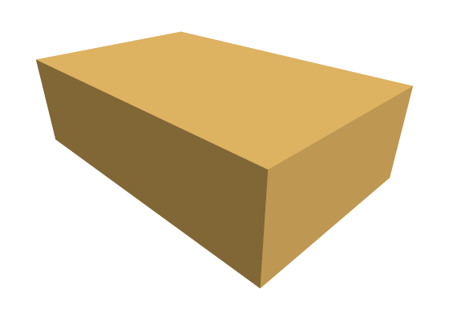

*The same rectangle, extruded into a solid.*

| Argument | |
| --- | --- |
| `size` | Number, or `[x, y]`. Default `1`. |
| `center` | `true` centres it on the origin. Default `false`. |
| `r` | BetterSCAD: corner radius. Default `0`, which is the stock square. |

`size` is a number or `[x, y]`, and defaults to `1`. `center = true` puts the origin in the middle instead of at the bottom-left corner.

A 2D shape has no thickness at all. You cannot mix it with 3D shapes in the same boolean — `union()` of a square and a cube is an error, not a shape.

BetterSCAD adds a third argument, `r`, which rounds the corners. It sits after `center`, matching `cube()`. See its own entry for the detail.

See also: [`cube(r), square(r)`](#entry-shape-radius) · [`circle()`](#entry-circle) · [`linear_extrude()`](#entry-linear_extrude)

<a id="entry-circle"></a>

### circle()

```
circle(r | d)
```

A flat disc, centred on the origin. Set the size with `r` (radius) or `d` (diameter).

```scad
circle(20);
```


*A disc of radius 20.*

```scad
circle(20, $fn = 5);
```

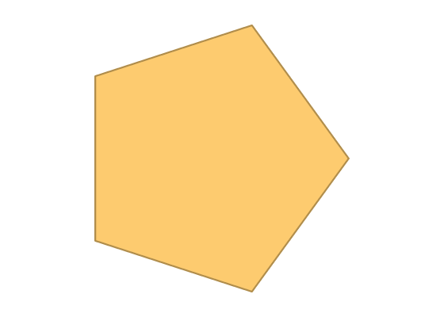

*`$fn = 5` makes the same call a pentagon.*

| Argument | |
| --- | --- |
| `r` | Radius. Default `1`. |
| `d` | Diameter. Overrides `r`. |

Like a sphere, it is really a many-sided polygon, and `$fn`, `$fa` and `$fs` decide how many sides.

`circle($fn = 3)` is a triangle, `circle($fn = 6)` a hexagon. That is often the tidiest way to draw a regular polygon — though `regular_polygon()` lets you give the side length instead of working back from a radius.

`d` wins if both are given. `r` defaults to `1`.

See also: [`regular_polygon()`](#entry-regular_polygon) · [`square()`](#entry-square) · [`$fn`](#entry-fn)

<a id="entry-polygon"></a>

### polygon()

```
polygon(points, paths, convexity)
```

A flat shape you draw by listing its corners in order, as if joining dots. The last corner joins back to the first on its own.

```scad
polygon([[0, 0], [40, 0], [40, 15], [20, 30], [0, 15]]);
```

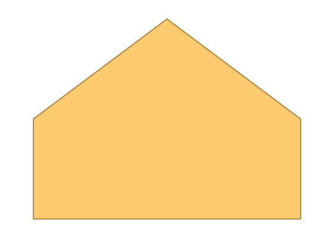

*Five corners, joined in the order they are listed.*

```scad
polygon(
  points = [[0, 0], [40, 0], [40, 40], [0, 40],
            [10, 10], [30, 10], [30, 30], [10, 30]],
  paths  = [[0, 1, 2, 3], [4, 5, 6, 7]]
);
```

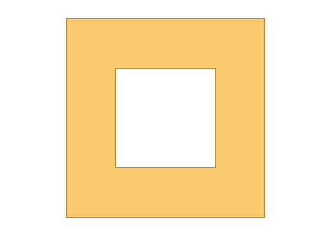

*The second path becomes a hole in the first.*

| Argument | |
| --- | --- |
| `points` | List of `[x, y]` corners. |
| `paths` | Lists of indices: first the outline, then the holes. |
| `convexity` | Accepted for compatibility; has no effect. |

`points` is a list of `[x, y]` corners.

Without `paths`, all the points form one outline. With `paths`, each entry is a list of indices into `points` describing one contour — the first is the outside and the rest are holes.

Contours may not cross themselves or each other. A self-intersecting outline has no well-defined inside, and the result will not be what you drew.

`convexity` is accepted for compatibility and has no effect.

See also: [`polyhedron()`](#entry-polyhedron) · [`circle()`](#entry-circle)

<a id="entry-text"></a>

### text()

```
text(text, size, font, halign, valign, spacing, direction, language, script)
```

Writes words as a flat shape you can extrude, cut out, or export. It is real geometry, not a label stuck on top.

```scad
text("Hello", size = 20);
```


*Flat letter outlines, sitting on the baseline at the origin.*

```scad
linear_extrude(height = 4) text("CAD", size = 24, halign = "center");
```

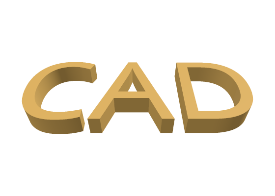

*Extruded into a solid you could print.*

| Argument | |
| --- | --- |
| `text` | The string to draw. |
| `size` | Font size. Default `10`. |
| `font` | `"Family"` or `"Family:style=Bold"`. |
| `halign` | `"left"` (default), `"center"`, `"right"`. |
| `valign` | `"baseline"` (default), `"top"`, `"center"`, `"bottom"`. |
| `spacing` | Letter-spacing multiplier. Default `1`. |
| `direction` | `"ltr"` (default), `"rtl"`, `"ttb"`, `"btt"`. |

`size` is the font size in the same units as everything else — roughly the height of a capital letter, not of the whole line. It defaults to `10`.

`font` is `"Family"`, or `"Family:style=Style"` for anything other than Regular. The app’s **Fonts** dialog previews every face in its own typeface and shows the exact string to use, so the spelling never has to be guessed.

`halign` is `"left"` (default), `"center"` or `"right"`. `valign` is `"baseline"` (default), `"top"`, `"center"` or `"bottom"`.

**Alignment is measured against the font, not against the letters you typed.** `valign` uses the font’s ascender and descender band, so `text("Ag")` and `text("xx")` get the same offset and a line does not jump when you type a letter with a tail. One consequence: centred text with no descender sits very slightly above the visual middle of its own ink, and that is correct.

`spacing` multiplies the gap between letters — `1` is the font’s own spacing, `1.2` opens it up. `direction` is `"ltr"`, `"rtl"`, `"ttb"` or `"btt"`.

`language` and `script` are accepted for compatibility.

See also: [`linear_extrude()`](#entry-linear_extrude) · [`offset()`](#entry-offset)

## Moving and changing shapes

Each of these takes the shapes written after it and changes where or how big they are.

<a id="entry-translate"></a>

### translate()

```
translate(v)
```

Slides a shape somewhere else. `[10, 0, 0]` means ten units along X and nowhere else.

```scad
%cube(20);
translate([30, 0, 0]) cube(20);
```

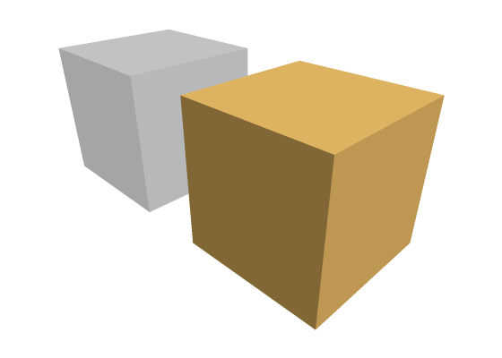

*The ghost is where the cube started; the solid is where `translate` put it.*

| Argument | |
| --- | --- |
| `v` | `[x, y, z]` offset. |

`v` is `[x, y, z]`, or `[x, y]` for 2D. Missing components are `0`.

It moves the shapes written after it, and only those. Everything else stays where it was.

BetterSCAD also accepts loose numbers — `translate(10, 5, 2)` — and one call per axis: `translatex()`, `translatey()`, `translatez()`.

See also: [`rotate()`](#entry-rotate) · [`scale()`](#entry-scale) · [`translatex(), translatey(), translatez()`](#entry-translatex)

<a id="entry-rotate"></a>

### rotate()

```
rotate(a) | rotate(a, v) | rotate([x, y, z])
```

Turns a shape. Angles are in degrees, and the shape turns around the origin — so a shape far from the origin swings around like something on the end of a rope.

```scad
%cube([40, 10, 10]);
rotate([0, 0, 35]) cube([40, 10, 10]);
```

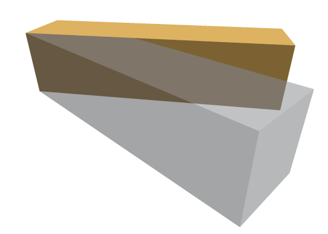

*35 degrees about Z. The bar pivots about the origin at its corner.*

```scad
rotate(45, [1, 1, 0]) cube(20, center = true);
```

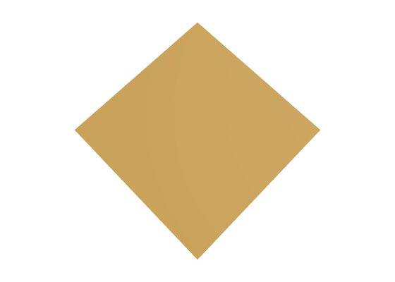

*`rotate(a, v)`: 45 degrees about the diagonal axis `[1, 1, 0]`.*

| Argument | |
| --- | --- |
| `a` | Degrees: a number, or `[x, y, z]`. |
| `v` | Axis to turn about, when `a` is a single number. |

`rotate([x, y, z])` turns about each axis in turn: Z first, then Y, then X.

`rotate(a)` with a single number turns `a` degrees about Z.

`rotate(a, v)` turns `a` degrees about the arbitrary axis `v`, using the right-hand rule — point your right thumb along `v` and your fingers curl the way it turns.

To spin a shape in place, centre it on the origin first (`cube(20, center = true)`), or rotate it and then translate it into position.

BetterSCAD also accepts loose numbers — `rotate(0, 0, 90)` — and one call per axis: `rotatex()`, `rotatey()`, `rotatez()`. The stock `rotate(a, v)` form is untouched.

See also: [`translate()`](#entry-translate) · [`mirror()`](#entry-mirror) · [`rotatex(), rotatey(), rotatez()`](#entry-rotatex)

<a id="entry-scale"></a>

### scale()

```
scale(v)
```

Makes a shape bigger or smaller. `2` doubles it; `0.5` halves it; `[2, 1, 1]` stretches it along X only.

```scad
%cube(20);
scale([2, 1, 0.5]) cube(20);
```

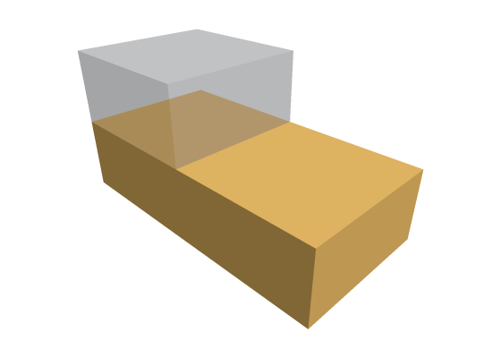

*Twice as wide, the same depth, half the height.*

| Argument | |
| --- | --- |
| `v` | Number, or `[x, y, z]` factors. |

`v` is a number for all axes, or `[x, y, z]` per axis. `1` means unchanged.

Scaling is measured from the origin, so a shape away from the origin moves further away as it grows.

A negative factor flips the shape across that axis as well as scaling it. For a pure flip, `mirror()` says what you mean.

A factor of `0` collapses the shape to nothing and reports a warning.

See also: [`resize()`](#entry-resize) · [`mirror()`](#entry-mirror)

<a id="entry-resize"></a>

### resize()

```
resize(newsize, auto)
```

Like `scale()`, but you say the size you want rather than how much to multiply by. "Make this 50 long", not "make this twice as long".

```scad
%cube([20, 20, 20]);
resize([50, 20, 10]) cube(20);
```

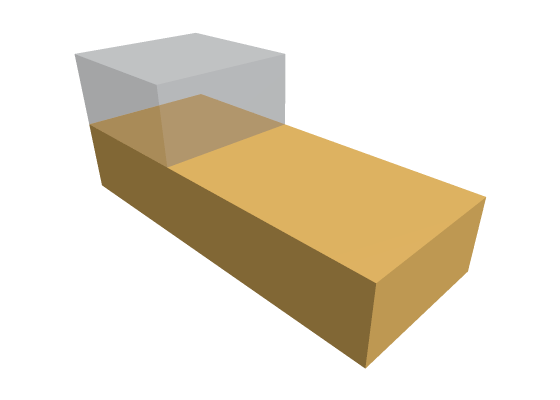

*The same cube, told to be exactly 50 x 20 x 10.*

| Argument | |
| --- | --- |
| `newsize` | `[x, y, z]` target size. `0` leaves that axis alone. |
| `auto` | `true`, or a per-axis list, to keep proportions. |

`newsize` is `[x, y, z]`, the size of the result’s bounding box.

A `0` in any slot leaves that axis alone — unless `auto` says otherwise.

`auto = true` scales the untouched axes by the same factor as the ones you gave, keeping the proportions. `auto` can also be a list, `[true, false, true]`, to pick per axis.

The measurement is the bounding box, not the shape — resizing a sphere and a spiky star to the same box makes their boxes match, not their outlines.

See also: [`scale()`](#entry-scale)

<a id="entry-mirror"></a>

### mirror()

```
mirror(v)
```

Flips a shape over, like holding it up to a mirror. `v` points at the mirror — `[1, 0, 0]` flips left to right.

```scad
cylinder(h = 16, r1 = 12, r2 = 0);
mirror([0, 0, 1]) cylinder(h = 16, r1 = 12, r2 = 0);
```

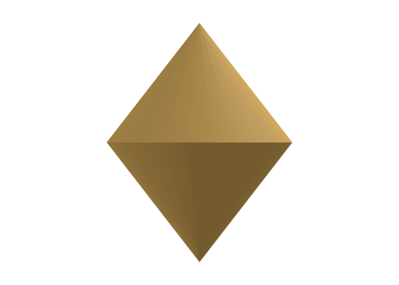

*A cone and its reflection in the ground plane, written as two statements.*

| Argument | |
| --- | --- |
| `v` | Normal of the mirror plane, e.g. `[1, 0, 0]`. |

`v` is the normal of the mirror plane: the direction the mirror faces. The plane itself always passes through the origin.

`[1, 0, 0]` mirrors across the YZ plane (swapping left and right), `[0, 1, 0]` across XZ, `[0, 0, 1]` across XY (swapping up and down).

The original is *not* kept. Write the shape twice — once plain, once mirrored — if you want both halves.

BetterSCAD also accepts loose numbers — `mirror(1, 0, 0)` — and one call per plane: `mirrorx()`, `mirrory()`, `mirrorz()`.

See also: [`mirrorx(), mirrory(), mirrorz()`](#entry-mirrorx) · [`rotate()`](#entry-rotate) · [`scale()`](#entry-scale)

<a id="entry-multmatrix"></a>

### multmatrix()

```
multmatrix(m)
```

Applies a move, turn, stretch and skew all at once, written as a grid of numbers. This is the raw form every other transform is built on.

```scad
%cube(20);
multmatrix([[1, 0.6, 0, 0],
            [0, 1,   0, 0],
            [0, 0,   1, 0]]) cube(20);
```

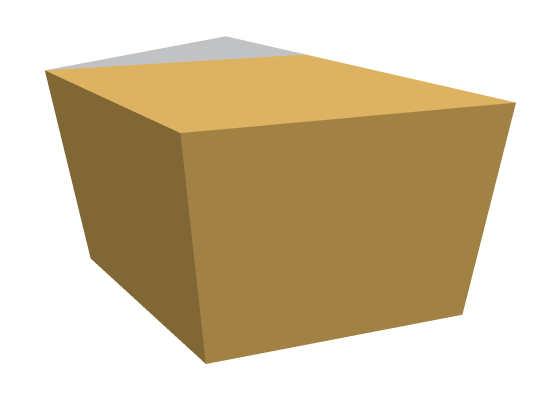

*A shear — the one thing the named transforms cannot express.*

| Argument | |
| --- | --- |
| `m` | 4x4 or 3x4 affine matrix, row-major. |

`m` is a 4x4 matrix, or a 3x4 one with the bottom row `[0, 0, 0, 1]` assumed. Rows are `[x, y, z, translation]`.

It can do everything the named transforms do, plus shear, which none of them expose.

Prefer the named transforms where they fit: `translate([10, 0, 0])` says what it does, and a matrix does not.

See also: [`translate()`](#entry-translate) · [`rotate()`](#entry-rotate) · [`scale()`](#entry-scale)

<a id="entry-color"></a>

### color()

```
color(c, alpha) | color([r, g, b, a])
```

Paints a shape a colour so you can tell parts apart on screen. It changes how the model looks, not what it is.

```scad
color("steelblue") cube([30, 20, 10]);
translate([0, 0, 10]) color([0.9, 0.3, 0.2]) cube([30, 20, 6]);
```

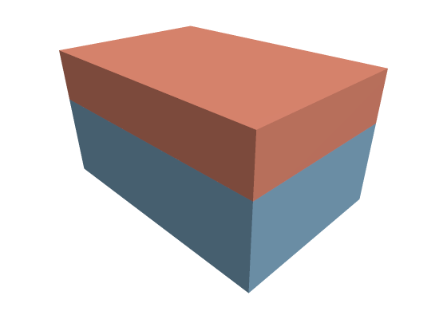

*Two parts, two colours, so the seam between them is visible.*

| Argument | |
| --- | --- |
| `c` | Colour name, `#hex`, or `[r, g, b]` / `[r, g, b, a]` in 0..1. |
| `alpha` | Transparency, `0`–`1`. Default `1`. |

`c` is a CSS colour name (`"red"`, `"steelblue"`), a `#rrggbb` string, or `[r, g, b]` with each component from `0` to `1`. A fourth component, or the separate `alpha` argument, sets transparency where `1` is solid.

**Colour is preview only.** STL has nowhere to put it and it is dropped on export; 3MF and AMF keep it. It never affects the geometry, and never affects a boolean.

The nearest enclosing `color()` wins, so a coloured part inside another `color()` keeps its own.

See also: [`% (ghost)`](#entry-background)

<a id="entry-offset"></a>

### offset()

```
offset(r | delta, chamfer)
```

Grows or shrinks a flat shape by the same amount all the way round, like drawing a line a few millimetres outside the edge. A negative number shrinks it instead.

```scad
offset(r = 6) square([40, 25], center = true);
```

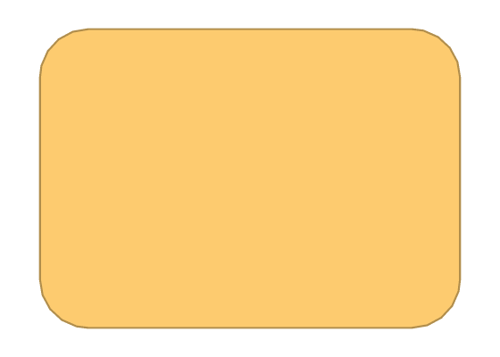

*`r` grows the square by 6 and rounds its corners to a radius of 6.*

```scad
offset(delta = 6) square([40, 25], center = true);
```


*The same growth with `delta`: corners stay sharp.*

| Argument | |
| --- | --- |
| `r` | Distance, with rounded outside corners. |
| `delta` | Distance, with sharp corners. |
| `chamfer` | With `delta`, cuts corners flat instead of sharp. |

**2D only.** There is no 3D offset.

`r` grows the shape and rounds every outside corner to that radius. `delta` grows it by the same distance but keeps corners sharp, extending the edges until they meet.

`chamfer = true` applies only with `delta`, and cuts the corner off flat instead of extending it to a point.

A negative value shrinks. Shrink a shape by more than its own narrowest half-width and parts of it simply vanish, which is a legitimate way to remove thin slivers.

`offset(r = 2) offset(r = -2)` is the standard trick for rounding inside corners while leaving outside ones alone.

See also: [`cube(r), square(r)`](#entry-shape-radius) · [`square()`](#entry-square) · [`minkowski()`](#entry-minkowski)

<a id="entry-hull"></a>

### hull()

```
hull()
```

Shrink-wraps everything inside it. Imagine stretching cling film over the shapes — you get the outside, and every dent is filled in.

```scad
hull() {
  sphere(8);
  translate([35, 0, 0]) sphere(8);
}
```

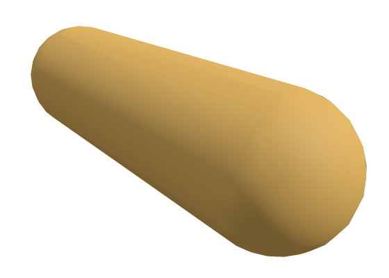

*Two balls, wrapped into a capsule.*

```scad
hull() {
  translate([0, 0]) circle(6);
  translate([40, 0]) circle(6);
  translate([40, 25]) circle(6);
  translate([0, 25]) circle(6);
}
```

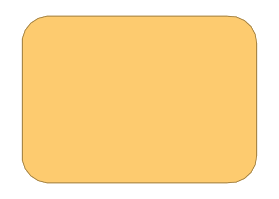

*Four circles hulled into a rounded rectangle.*

The result is the **convex hull**: the smallest shape with no dents that still contains everything you gave it.

Two spheres hulled together make a capsule; four circles at the corners of a rectangle hull into a rounded rectangle. That second one is exactly how `square(r = …)` is built.

All children must be the same dimension — all 2D, or all 3D. A 2D hull gives a 2D shape.

Holes inside the children do not survive: a hull has no interior detail by definition.

See also: [`minkowski()`](#entry-minkowski) · [`cube(r), square(r)`](#entry-shape-radius)

<a id="entry-minkowski"></a>

### minkowski()

```
minkowski()
```

Rolls one shape around the outside of another, so the first one grows by the shape of the second. Roll a ball around a box and you get a box with rounded edges.

```scad
minkowski() {
  cube([30, 20, 6]);
  sphere(3, $fn = 16);
}
```

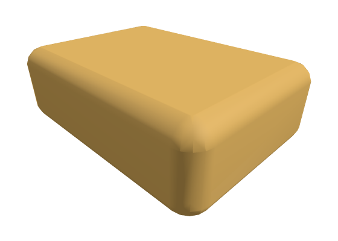

*A slab with every edge and corner rounded by a 3-unit ball.*

Formally: the Minkowski sum, every point of the first child added to every point of the second.

The result grows — a `cube(10)` plus a `sphere(2)` is `14` across, not `10`. Shrink the original by the rolling radius first if you want to keep the outside size.

**It is expensive.** Cost rises with the product of the two shapes’ complexity, so keep the second one simple and low-resolution. A `$fn = 12` sphere is usually plenty.

For the common case of rounding a box, `cube(r = …)` gives the same shape from a hull, at a small fraction of the cost.

See also: [`hull()`](#entry-hull) · [`cube(r), square(r)`](#entry-shape-radius) · [`offset()`](#entry-offset)

## Combining shapes

Add shapes together, cut one out of another, or keep only the overlap.

<a id="entry-union"></a>

### union()

```
union()
```

Glues shapes together into one. Anywhere any of them is solid, the result is solid.

```scad
union() {
  cube([30, 30, 8], center = true);
  cylinder(h = 26, r = 7, center = true);
}
```

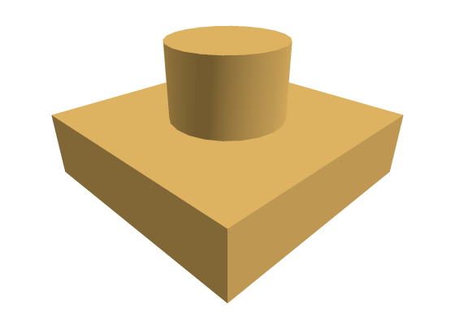

*One solid, not two touching ones.*

You rarely have to write it: shapes sitting side by side in the same block are already unioned. It is worth writing when you need a group to act as a single child of something else — the first child of a `difference()`, say.

Overlapping unioned shapes merge properly; they do not leave a wall between them.

All children must be the same dimension.

See also: [`difference()`](#entry-difference) · [`intersection()`](#entry-intersection)

<a id="entry-difference"></a>

### difference()

```
difference()
```

Cuts shapes out of the first one. The first shape is the material; everything after it is a hole.

```scad
difference() {
  cube([40, 40, 12], center = true);
  cylinder(h = 20, r = 12, center = true);
}
```

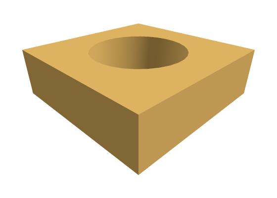

*The cylinder is removed from the block, leaving a hole through it.*

**Order matters.** The first child is kept and every later child is removed from it.

Make the cutting shape slightly longer than the thing it passes through. A hole that ends exactly flush with the surface leaves a zero-thickness face, which shows up as flickering on screen and as a defect in the export. Sticking out by `0.01` on each side is enough.

All children must be the same dimension.

BetterSCAD’s `negative()` does the same job written the other way round — the hole next to the thing it goes through, instead of a `difference()` wrapped around both.

See also: [`negative()`](#entry-negative) · [`union()`](#entry-union) · [`intersection()`](#entry-intersection)

<a id="entry-intersection"></a>

### intersection()

```
intersection()
```

Keeps only the part where every shape overlaps. If one of them is missing from a spot, nothing is left there.

```scad
intersection() {
  cube(26, center = true);
  sphere(17);
}
```

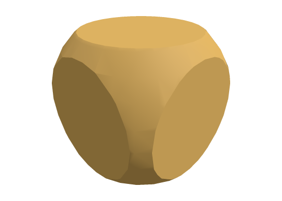

*Only the volume inside both the cube and the sphere survives.*

Order does not matter, unlike `difference()`.

It is the usual way to trim something to a boundary: intersect a complicated part with a big cube to chop everything outside that cube away.

All children must be the same dimension. With no overlap at all, the result is empty.

See also: [`union()`](#entry-union) · [`difference()`](#entry-difference) · [`intersection_for`](#entry-intersection_for)

## Between 2D and 3D

Turn a flat outline into a solid, or flatten a solid back into an outline.

<a id="entry-linear_extrude"></a>

### linear_extrude()

```
linear_extrude(height, center, convexity, twist, slices, scale, v)
```

Takes a flat shape and pulls it straight upward into a solid, like squeezing toothpaste through a shaped nozzle.

```scad
linear_extrude(height = 20) square([30, 18], center = true);
```

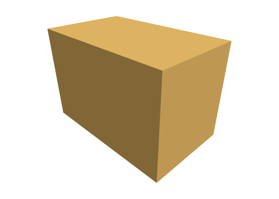

*A flat rectangle pulled up into a block.*

```scad
linear_extrude(height = 40, twist = 180, scale = 0.4, $fn = 60)
  square([24, 24], center = true);
```

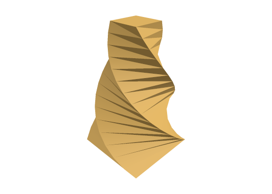

*`twist` and `scale` applied over the same extrusion.*

| Argument | |
| --- | --- |
| `height` | Extrusion distance. Default `100`. |
| `center` | `true` centres it on the origin. Default `false`. |
| `twist` | Degrees of rotation over the height. Clockwise from above. |
| `scale` | Size at the top: a number or `[x, y]`. Default `1`. |
| `slices` | Steps used for a twist. Default: derived from `twist`. |
| `v` | Direction to extrude along. Default `[0, 0, 1]`. |

`height` is how far it is pulled. `center = true` splits that about the origin, from `-height/2` to `+height/2`.

`twist` rotates the top relative to the bottom, in degrees, giving a spiral. Note that it turns **clockwise** seen from above, which is the opposite of `rotate()`.

`scale` shrinks or grows the shape as it rises — a number, or `[x, y]` for a different factor on each axis. `scale = 0` brings it to a point.

`slices` is how many horizontal steps the twist is cut into. More is smoother and heavier. Left alone, it is chosen from the twist angle.

`v` extrudes along an arbitrary direction instead of straight up Z.

The child must be 2D. `convexity` is accepted for compatibility and has no effect.

See also: [`rotate_extrude()`](#entry-rotate_extrude) · [`projection()`](#entry-projection) · [`square()`](#entry-square)

<a id="entry-rotate_extrude"></a>

### rotate_extrude()

```
rotate_extrude(angle, start, convexity)
```

Spins a flat shape around the vertical axis to make a round solid — the way a potter’s wheel turns a flat profile into a bowl.

```scad
rotate_extrude($fn = 64)
  translate([20, 0]) circle(6, $fn = 32);
```

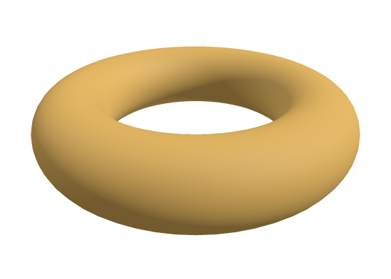

*A circle held 20 away from the axis, swept all the way round: a doughnut.*

```scad
rotate_extrude(angle = 240, $fn = 64)
  translate([20, 0]) square([8, 14]);
```

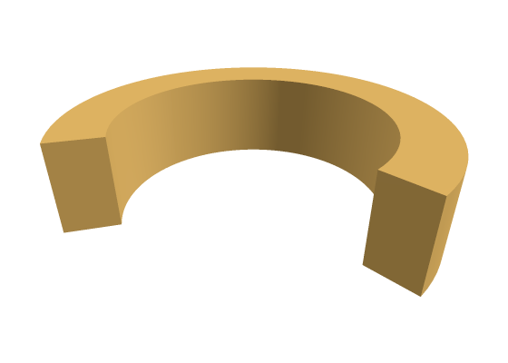

*`angle = 240` stops the sweep two-thirds of the way round.*

| Argument | |
| --- | --- |
| `angle` | Degrees to sweep. Default `360`. |
| `start` | Angle the sweep begins at. Default `0`. |

The profile must sit at **x >= 0**. Anything at negative X would sweep through the axis and turn the solid inside out, so it is an error.

`angle` is how far round it goes, in degrees. The default is `360`, a full revolution; less leaves an open wedge with flat faces at each end.

`start` is the angle it begins at, so `start`/`angle` together place the wedge.

The profile is taken in the XZ plane: X becomes the distance from the axis, and the profile’s Y becomes the model’s Z.

Resolution follows `$fn`/`$fa`/`$fs`, measured on the largest radius.

`convexity` is accepted for compatibility and has no effect.

See also: [`linear_extrude()`](#entry-linear_extrude) · [`cylinder()`](#entry-cylinder)

<a id="entry-projection"></a>

### projection()

```
projection(cut)
```

Flattens a solid back into a flat outline — either its shadow from directly above, or the slice where it crosses the ground.

```scad
projection() {
  cylinder(h = 30, r1 = 20, r2 = 6);
  translate([0, 0, 10]) cube([44, 8, 6], center = true);
}
```


*The shadow of a cone and a bar, flattened into one outline.*

```scad
projection(cut = true)
  translate([0, 0, -8]) difference() {
    cylinder(h = 30, r = 20, $fn = 64);
    translate([0, 0, -1]) cylinder(h = 32, r = 12, $fn = 64);
  }
```

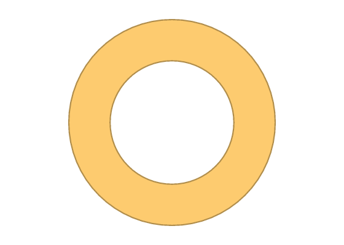

*A slice through a tube, taken at `z = 0` after moving the tube down. A shadow of the same tube would have been a solid disc — the hole only survives in a section.*

| Argument | |
| --- | --- |
| `cut` | `true` slices at `z = 0` instead of casting a shadow. |

`cut = false` (the default) is the shadow: everything the solid covers, seen from above, merged into one outline.

`cut = true` is a cross-section: the exact slice of the solid at `z = 0`. Translate the solid down first to slice it somewhere else.

The result is 2D, so it can be extruded again, offset, or exported as SVG or DXF.

See also: [`linear_extrude()`](#entry-linear_extrude) · [`offset()`](#entry-offset)

## Writing a model

The rules the file itself follows.

<a id="entry-variables"></a>

### name = value;

Gives a number, a word or a list a name, so you can use it in several places and change it in one. Every statement ends in a semicolon.

```scad
width = 40;
height = 12;
cube([width, width, height]);
```

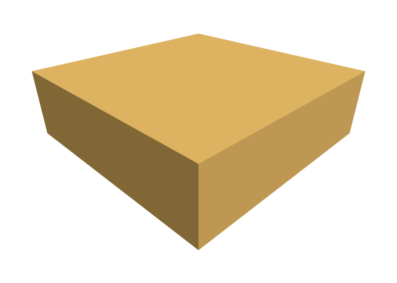

*One value, named once, used twice.*

```scad
a = 1;
echo(a);
a = 2;
```

```
ECHO: 2
```

*The last assignment wins for the whole scope, even above itself.*

**A variable is not a box you keep putting new things in.** Within one scope, the *last* assignment to a name wins everywhere in that scope, including on lines above it. Assignments are all evaluated before any shape is drawn.

So `a = 1; echo(a); a = 2;` prints `2`. This surprises everyone once; it is how OpenSCAD has always worked, and BetterSCAD matches it exactly.

Assignments still evaluate in source order, so a *read* on an earlier line sees the earlier value: `a = 1; b = a; a = 2;` leaves `b` at `1`.

Values are numbers, booleans, strings, ranges, lists, functions, or `undef`. Lists are written `[1, 2, 3]` and indexed from zero: `v[0]`. A list can hold anything, including other lists.

Comments are `//` to the end of the line, or `/* … */` across several.

See also: [`module`](#entry-module) · [`function`](#entry-function) · [`let()`](#entry-let)

<a id="entry-operators"></a>

### Operators

```
+  -  *  /  %  ^   <  <=  ==  !=  >=  >   &&  ||  !   ? :   v[i]   [a : b]
```

The arithmetic and comparison symbols. Most behave the way you would expect from a calculator; the ones worth knowing about are what `*` does to two lists, and the fact that `/` never rounds.

```scad
echo(7 / 2, 7 % 3, -7 % 3, 2 ^ 10);
```

```
ECHO: 3.5, 1, -1, 1024
```

```scad
echo([1, 2, 3] + [10, 20, 30], [1, 2, 3] * 2, [1, 2] * [3, 4]);
```

```
ECHO: [11, 22, 33], [2, 4, 6], 11
```

*The last one is the dot product: two lists multiplied together give one number.*

```scad
v = [10, 20, 30];
echo(v[1], v[9], [1, 2] == [1, 2]);
```

```
ECHO: 20, undef, true
```

**Arithmetic** is `+ - * / %`. Division is always exact: `7 / 2` is `3.5`, never `3`. `%` is the remainder, and takes its sign from the left-hand side — `-7 % 3` is `-1`.

That `%` is unrelated to the `%` that makes a shape a ghost. They never collide: one sits between two numbers, the other in front of a statement.

`^` raises to a power, the same as `pow()`. It binds tighter than a leading minus, so `-2 ^ 2` is `-4`, and it groups to the right, so `2 ^ 3 ^ 2` is `512`.

**Lists do arithmetic too**, and `*` means three different things depending on what is on each side. `+` and `-` work element by element on two lists of the same length. `[1, 2, 3] * 2` scales every element. `[1, 2] * [3, 4]` is the **dot product**, a single number — `11`, not a list. And a matrix times a vector is a matrix multiplication.

**Comparison** is `< <= == != >= >`. `==` compares lists element by element, however deeply nested, so `[1, 2] == [1, 2]` is `true`. Strings compare in dictionary order.

**Logic** is `&&` (and), `||` (or) and `!` (not). `&&` and `||` stop as soon as the answer is known, so the right-hand side of `is_list(x) && len(x) > 0` is safe.

`condition ? a : b` picks between two **values**, and works anywhere a value does — including inside a function, where `if` cannot go.

`v[i]` reads element `i` of a list, counting from `0`, or character `i` of a string. Past the end it is `undef` rather than an error, which is the single most common source of a mysterious `undef` further down.

`[a : b]` is a **range**, and `[a : step : b]` steps by something other than 1. Both ends are included. A range is its own kind of value, not a list — `[0 : 3]` prints as `[0 : 1 : 3]`, and `is_list()` says `false`. Use `is_range()` to test for one.

There is no `+` for joining lists or strings. `concat()` joins lists and `str()` joins text.

See also: [`name = value;`](#entry-variables) · [`pow()`](#entry-pow) · [`if / else`](#entry-if) · [`is_range()`](#entry-is_range) · [`concat()`](#entry-concat) · [`% (ghost)`](#entry-background)

<a id="entry-module"></a>

### module

```
module name(params) { … }
```

Gives a piece of a model a name so you can use it again and again. Define it once, then write `name();` wherever you want one.

```scad
module post(h = 20, d = 8) {
  cylinder(h = h, d = d, $fn = 32);
}

post();
translate([20, 0, 0]) post(h = 30);
translate([40, 0, 0]) post(h = 12, d = 14);
```

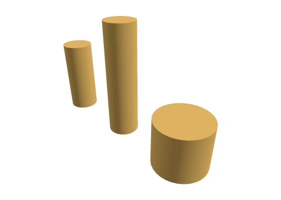

*One definition, three posts, each a different size.*

Parameters may have defaults: `module peg(d = 4, h = 10)`. Callers can pass arguments in order, or by name — `peg(h = 20)` — and named arguments may come in any order.

A module’s body is its own scope. Variables it defines are invisible outside, and variables outside are visible inside only if they were in scope **where the module was written**, not where it was called. `$`-variables are the exception; see below.

A module can take children: shapes written in braces after the call, reached with `children()`.

Modules may call themselves. Recursion is capped at 200 levels deep, which reports a clear error rather than hanging the tab.

See also: [`function`](#entry-function) · [`children()`](#entry-children) · [`name = value;`](#entry-variables)

<a id="entry-function"></a>

### function

```
function name(params) = expression;
```

Names a calculation rather than a shape. You give it some numbers and it hands one value back.

```scad
function ring_r(teeth, pitch) = teeth * pitch / (2 * PI);

echo(ring_r(24, 3));
```

```
ECHO: 11.4592
```

*A named calculation, used the way you would use a number.*

```scad
function stack(n) = [for (i = [0 : n - 1]) i * 6];

for (z = stack(5)) translate([0, 0, z]) cube([20, 20, 4]);
```


*A function returning a list, driving a loop.*

The body is a **single expression** — there are no statements inside a function and nothing to return. Use `let()` to name intermediate values, and `a ? b : c` to choose between them.

Functions may be recursive, under the same 200-level cap as modules.

A function can also be a value: `f = function (x) x * 2;` creates one without a name, and `f(4)` calls it. That makes functions passable as arguments.

A function cannot produce geometry, and a module cannot return a value. They are separate for that reason.

See also: [`module`](#entry-module) · [`let()`](#entry-let) · [`List comprehensions`](#entry-list-comprehension)

<a id="entry-children"></a>

### children()

```
children() | children(i) | children([a : b]) | children([i, j])
```

Inside a module, this stands for whatever shapes were written after the call. It lets you write a module that does something *to* a shape without knowing what the shape is.

```scad
module ring(n = 6, r = 26) {
  for (i = [0 : n - 1]) rotate([0, 0, i * 360 / n]) translate([r, 0, 0]) children();
}

ring() cube(8, center = true);
```

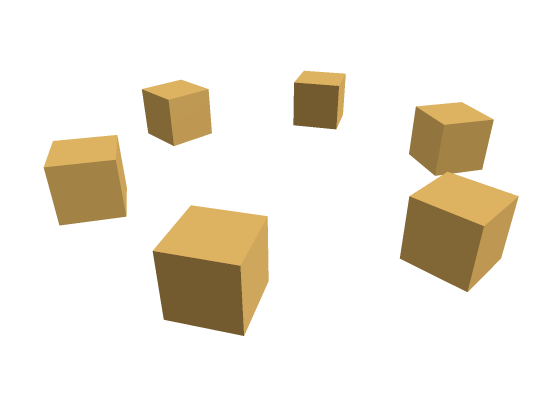

*The module arranges the shape; the caller decides what the shape is.*

`children()` with no argument instantiates all of them, in order.

`children(i)` picks one, counting from `0`. `children([1 : 3])` takes a range, and `children([0, 2])` takes a specific list.

`$children` is how many there are, which is what you loop over to handle any number.

Children are instantiated where `children()` is written, so any transform wrapped around the call applies to them.

See also: [`module`](#entry-module) · [`$children`](#entry-children-count)

<a id="entry-include"></a>

### include <…>

```
include <path>
```

Pastes another file into this one, as if you had typed it here. Its variables and its shapes all come along.

```scad
include <shared/hardware.scad>

m3_bolt(len = 16);
```

The path is relative to the file doing the including. Angle brackets are part of the syntax, and there is no semicolon.

Because the whole file is spliced in, any geometry at the top level of the included file is drawn. Use `use <…>` when you want only the definitions.

Included files may include others. The chain is followed breadth-first and capped at 32 levels, and a cycle is detected rather than followed.

In the app, files opened in other tabs resolve as includes, so a project can be split across tabs.

See also: [`use <…>`](#entry-use)

<a id="entry-use"></a>

### use <…>

```
use <path>
```

Borrows the modules and functions from another file, without drawing anything that file draws by itself.

```scad
use <shared/gears.scad>

gear(teeth = 24);
```

Same path rules as `include`, and no semicolon.

Definitions come across; top-level variables and top-level geometry do not. That makes it the right choice for a library that also has test shapes in it.

See also: [`include <…>`](#entry-include)

## Repeating and choosing

Draw something many times, or only sometimes.

<a id="entry-for"></a>

### for

```
for (i = [start : end]) … | for (i = [start : step : end]) … | for (i = list) …
```

Draws its shapes once for every value in a list or a range. The loop variable takes each value in turn, so each copy can be a bit different.

```scad
for (i = [0 : 5]) translate([i * 14, 0, 0]) cube([10, 10, 4 + i * 4]);
```

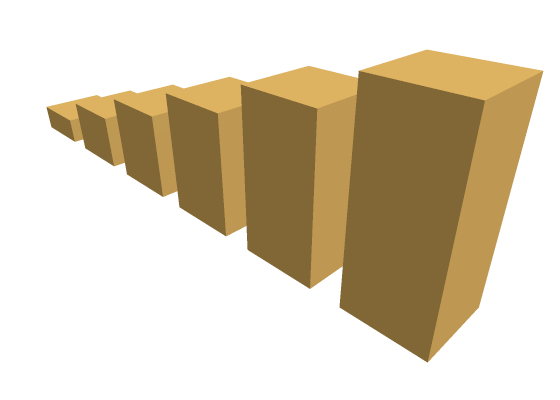

*Six copies, each using `i` for both its position and its height.*

```scad
for (x = [0 : 2], y = [0 : 2]) translate([x * 16, y * 16, 0]) cylinder(h = 10, r = 5, $fn = 24);
```

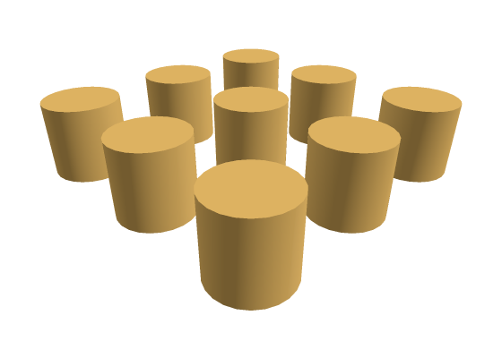

*Two variables in one `for`: every combination, so nine pegs.*

`[0 : 4]` counts 0, 1, 2, 3, 4 — **both ends included**, unlike most languages. `[0 : 2 : 10]` counts in twos. A negative step counts down.

`for (v = [10, 25, 40])` walks a list instead of a range.

Several variables can be given at once: `for (x = [0:2], y = [0:2])` runs every combination — nine times here, not three.

Everything a `for` draws is unioned together. It is a loop over geometry, not a loop that changes variables: the loop variable exists only inside the body, and assigning to a variable in the body does not carry to the next pass.

One range may not produce more than 1,000,000 values; beyond that it reports an error rather than hanging.

BetterSCAD also accepts the C-style `for (i = 0; i < n; i = i + 1)` as a statement.

See also: [`C-style for`](#entry-c-style-for) · [`intersection_for`](#entry-intersection_for) · [`List comprehensions`](#entry-list-comprehension)

<a id="entry-intersection_for"></a>

### intersection_for

```
intersection_for (i = range) …
```

Like `for`, but instead of adding every copy together it keeps only the part they all share. Useful for carving a shape from many directions at once.

```scad
intersection_for (a = [0 : 45 : 135])
  rotate([0, 0, a]) cube([46, 18, 12], center = true);
```

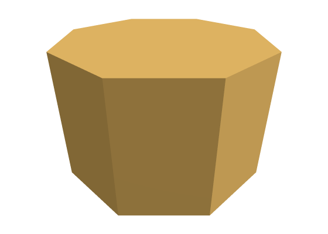

*Four bars at different angles; only the core common to all of them survives.*

It exists because a plain `for` inside an `intersection()` would union its copies first, leaving the intersection with a single child and nothing to do.

With no iterations at all the result is empty.

See also: [`intersection()`](#entry-intersection) · [`for`](#entry-for)

<a id="entry-if"></a>

### if / else

```
if (condition) … else …
```

Draws one thing when something is true, and optionally something else when it is not.

```scad
rounded = true;

if (rounded) cylinder(h = 12, r = 15, $fn = 48);
else cube([30, 30, 12], center = true);
```

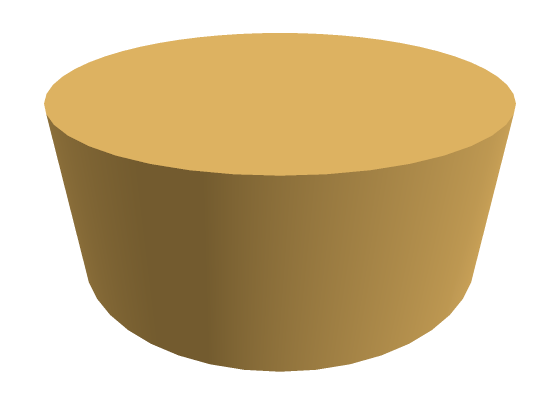

*One flag at the top of the file chooses which shape gets drawn.*

Comparisons: `==`, `!=`, `<`, `<=`, `>`, `>=`. Combine them with `&&` (and), `||` (or) and `!` (not).

`else if` chains as you would expect.

For choosing between two *values* rather than two shapes, use the conditional expression `condition ? a : b`, which works anywhere a value does — including inside a function.

`undef`, `false`, `0`, `""` and `[]` all count as false; everything else counts as true.

See also: [`name = value;`](#entry-variables) · [`let()`](#entry-let)

<a id="entry-let"></a>

### let()

```
let (name = value, …) expression-or-statement
```

Names a value for one expression or one statement only. Handy inside a function, where you cannot write ordinary assignments.

```scad
function hyp(a, b) = let (sq = a * a + b * b) sqrt(sq);

echo(hyp(3, 4));
```

```
ECHO: 5
```

*A named intermediate value inside a function body.*

Bindings are evaluated in order and each one can see the ones before it.

The names disappear at the end of the `let`. A name that already exists is shadowed, not overwritten.

It works both as a statement wrapping geometry and as an expression inside a formula.

See also: [`function`](#entry-function) · [`name = value;`](#entry-variables)

<a id="entry-list-comprehension"></a>

### List comprehensions

```
[ for (i = range) expr ]
```

Builds a list by running a small rule over a range — "for every `i` from 0 to 9, give me `i` squared" — instead of typing the list out.

```scad
points = [for (a = [0 : 30 : 330]) [20 * cos(a), 20 * sin(a)]];

polygon(points);
```


*Twelve points calculated round a circle, then joined into a polygon.*

```scad
echo([for (i = [0 : 9]) if (i % 2 == 0) i]);
```

```
ECHO: [0, 2, 4, 6, 8]
```

*`if` inside a comprehension drops the entries that do not match.*

`[for (i = [0 : 4]) i * i]` is `[0, 1, 4, 9, 16]`.

`if` filters: `[for (i = [0 : 9]) if (i % 2 == 0) i]` keeps the even ones. An `else` may follow it to substitute a value instead of dropping the entry.

`each` splices a nested list in flat instead of nesting it: `[for (p = pairs) each p]`.

`let` names intermediate values inside the comprehension.

The C-style form `[for (i = 0; i < n; i = i + 1) …]` is allowed here in stock OpenSCAD, and BetterSCAD also allows it as a statement.

See also: [`for`](#entry-for) · [`function`](#entry-function) · [`C-style for`](#entry-c-style-for)

## Modifier characters

One character in front of a shape, for finding your way around a model while you are working on it. None of them change the geometry.

<a id="entry-disable"></a>

### * (disable)

```
* shape;
```

Switches a shape off. It stays in the file but is not drawn — like commenting it out, except it still has to be valid code.

```scad
cube([30, 30, 8], center = true);
*translate([0, 0, 12]) sphere(10);
```

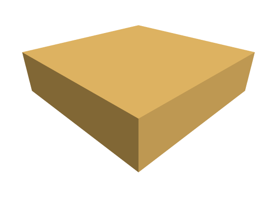

*The sphere is written in the file and is not drawn.*

Applies to the whole statement after it, children included.

It affects exports as well as the preview: a disabled shape is not there at all.

See also: [`! (show only this)`](#entry-root) · [`# (highlight)`](#entry-highlight) · [`% (ghost)`](#entry-background)

<a id="entry-root"></a>

### ! (show only this)

```
! shape;
```

Shows only this shape and throws everything else away, so you can look at one part of a big model on its own.

```scad
cube([40, 40, 8], center = true);
!translate([0, 0, 14]) sphere(10, $fn = 48);
```


*Only the marked sphere is rendered; the plate is dropped.*

The marked subtree becomes the whole model. Its ancestors still apply their transforms to it, but their *other* children are discarded.

Only one `!` takes effect; if there are several, the first one found wins.

It affects exports too — a file with a stray `!` exports only that part, which is worth remembering before wondering where the rest of the model went.

See also: [`* (disable)`](#entry-disable) · [`# (highlight)`](#entry-highlight)

<a id="entry-highlight"></a>

### # (highlight)

```
# shape;
```

Draws a shape in a bright colour so you can pick it out of everything around it, while leaving it exactly where it was and exactly what it was.

```scad
cube([40, 40, 10], center = true);
#translate([0, 0, 13]) sphere(8, $fn = 48);
```

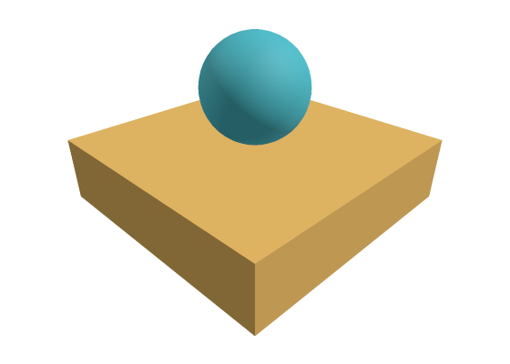

*The sphere is still part of the model; the cyan only says "this one".*

```scad
difference() {
  cube([40, 40, 12], center = true);
  cylinder(h = 30, r = 8, center = true, $fn = 40);
}
%cylinder(h = 30, r = 8, center = true, $fn = 40);
```

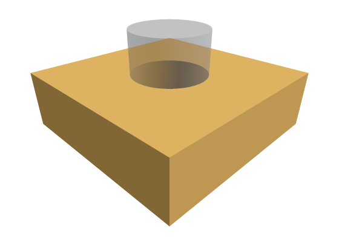

*The workaround: a `%` ghost of the cutter, alongside the real one.*

It is a preview treatment only: the shape still contributes whatever it was contributing, and exports are untouched.

BetterSCAD draws it in the cool cyan reserved for exactly this, so a highlighted shape can never be mistaken for model material — the model is amber.

**A `#` on a cutting shape inside a `difference()` is not drawn.** Stock OpenSCAD shows the cutter as a transparent highlighted volume, which is the single most common use of the modifier; here the boolean consumes the cutter before the preview sees it, so there is nothing left to colour. Until that gap is closed, use `%` on a copy of the cutter to see where a hole is going.

See also: [`% (ghost)`](#entry-background) · [`difference()`](#entry-difference)

<a id="entry-background"></a>

### % (ghost)

```
% shape;
```

Draws a shape as a faint ghost, for reference only. It does not join anything, cut anything or get exported — it is just there to look at.

```scad
%cylinder(h = 40, r = 16, $fn = 48);
cube([20, 20, 40]);
```

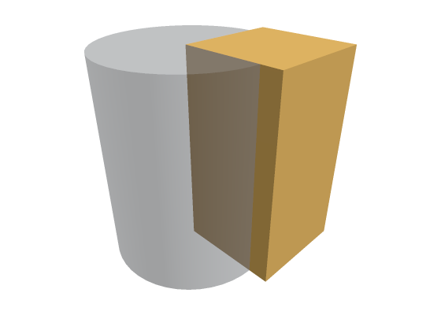

*The cylinder is reference only: nothing is unioned, nothing is exported.*

Use it for the thing your part has to fit: the board, the enclosure, the bolt.

It is deliberately kept out of every boolean, so a `difference()` cannot cut with it even when it is written as a child of one.

Every "before" ghost in this reference is a `%` shape.

See also: [`# (highlight)`](#entry-highlight) · [`color()`](#entry-color)

## Special variables

Variables whose names start with `$`. They pass down into everything you call, so setting one affects the whole subtree beneath it.

<a id="entry-fn"></a>

### $fn

How many flat sides to use when drawing something round. Low numbers are fast and chunky; high numbers are smooth and slow. `0` means "work it out from `$fa` and `$fs`".

```scad
$fn = 6;
cylinder(h = 12, r = 14);
```

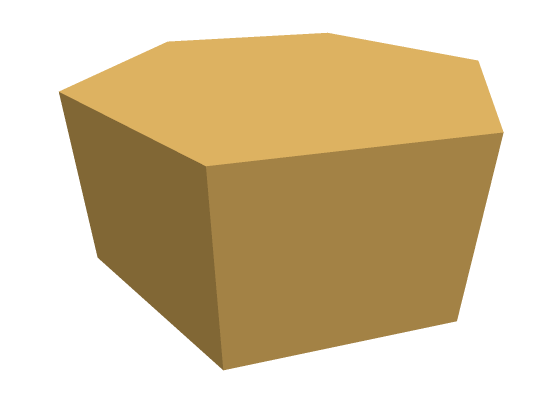

*Six sides, on purpose.*

When `$fn` is greater than `0` it wins outright and `$fa`/`$fs` are ignored.

It can be set for the whole file (`$fn = 64;` at the top), for one subtree (`cylinder(h = 5, r = 3, $fn = 6)`), or anywhere in between.

A common pattern ties it to the preview flag, so editing stays fast and exports stay smooth: `$fn = $preview ? 24 : 96;`.

It is also how you draw a deliberate polygon: `$fn = 6` on a cylinder is a hex rod.

Default `0`.

See also: [`$fa`](#entry-fa) · [`$fs`](#entry-fs) · [`$preview`](#entry-preview) · [`circle()`](#entry-circle)

<a id="entry-fa"></a>

### $fa

The biggest angle one flat side of a curve is allowed to cover. Smaller means more sides and a smoother curve.

In degrees. Default `12`, which is 30 sides for a full circle.

Ignored when `$fn` is set.

Used together with `$fs`: the number of sides is whichever of the two rules asks for more, with a floor of 5.

See also: [`$fn`](#entry-fn) · [`$fs`](#entry-fs)

<a id="entry-fs"></a>

### $fs

The shortest a flat side is allowed to be. It keeps small circles from being wastefully detailed and big ones from being chunky.

In model units. Default `2`.

Ignored when `$fn` is set.

Because it is a length, a large circle gets more sides than a small one automatically — which is usually what you want and is why leaving `$fn` alone is often the better default.

See also: [`$fn`](#entry-fn) · [`$fa`](#entry-fa)

<a id="entry-t"></a>

### $t

The animation clock: a number that runs from 0 to 1 and back to 0 as the animation plays. Use it in your model and the model moves.

```scad
rotate([0, 0, $t * 360]) translate([20, 0, 0]) cube(8, center = true);
```

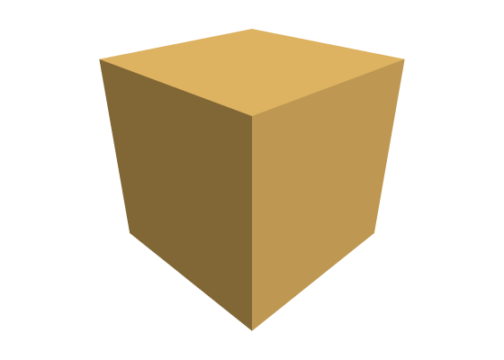

*At `$t = 0` — the first frame of a full revolution.*

It is `0` for an ordinary render. The app’s animation bar plays it; `bscad --frames n` renders a sequence with it.

Anything can depend on it: `rotate([0, 0, $t * 360])` spins a part through one full turn over the animation.

See also: [`$preview`](#entry-preview)

<a id="entry-preview"></a>

### $preview

`true` while you are editing (F5), `false` for the final render (F6) and for every export. Use it to draw a quick version while you work and the good one when it counts.

```scad
$fn = $preview ? 12 : 96;
sphere(10);
```

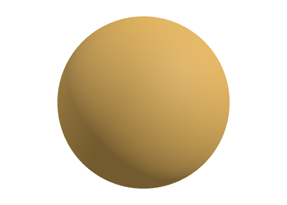

*Coarse while editing, smooth on export. Every screenshot in this reference is a final render, so this is the 96-sided branch.*

In stock OpenSCAD, F5 and F6 use two different geometry engines, and `$preview` tells you which. **BetterSCAD produces exact geometry either way** — so the two differ only for models that read `$preview` and deliberately simplify themselves.

The usual use is resolution: `$fn = $preview ? 12 : 96;`.

See also: [`$fn`](#entry-fn) · [`$t`](#entry-t)

<a id="entry-children-count"></a>

### $children

Inside a module, how many shapes were handed to it.

Used with `children(i)` to walk them one at a time — `for (i = [0 : $children - 1])`.

It is `0` in a module called with no children, which is the tidy way to give a module a different default when nothing was passed.

See also: [`children()`](#entry-children) · [`module`](#entry-module)

<a id="entry-vpr"></a>

### $vpr, $vpt, $vpd, $vpf

Where the camera is right now: its rotation, what it is looking at, how far away it is, and how wide its lens is. A model can read these and react to the view.

`$vpr` is `[x, y, z]` rotation in degrees, `$vpt` the point being looked at, `$vpd` the distance, `$vpf` the field of view.

BetterSCAD’s orbit camera maps onto OpenSCAD’s convention exactly: `$vpr` is `[polar, 0, azimuth + 90]`, so `[90, 0, 0]` is the front view and `[0, 0, 0]` is the top.

Reading them makes a model depend on the view, which means it renders differently in the app and on the command line. Useful for labels that always face you; a trap for anything you intend to export.

See also: [`$t`](#entry-t)

## Maths

All the usual arithmetic. **Angles are in degrees everywhere**, not radians — which is the one thing to remember if you have used these functions in another language.

<a id="entry-abs"></a>

### abs()

```
abs(x)
```

Drops the minus sign. `abs(-5)` and `abs(5)` are both `5`.

```scad
echo(abs(-5), abs(5));
```

```
ECHO: 5, 5
```

<a id="entry-sign"></a>

### sign()

```
sign(x)
```

Tells you which way a number points: `-1` for negative, `1` for positive, `0` for zero.

```scad
echo(sign(-8), sign(0), sign(3.2));
```

```
ECHO: -1, 0, 1
```

<a id="entry-sin"></a>

### sin(), cos(), tan()

```
sin(degrees) | cos(degrees) | tan(degrees)
```

The trigonometry functions — the tools for working out positions around a circle. `cos` gives the across, `sin` gives the up.

```scad
echo(sin(30), cos(60), sin(180));
```

```
ECHO: 0.5, 0.5, 0
```

```scad
for (a = [0 : 30 : 330])
  translate([26 * cos(a), 26 * sin(a), 0]) cylinder(h = 6, r = 4, $fn = 24);
```

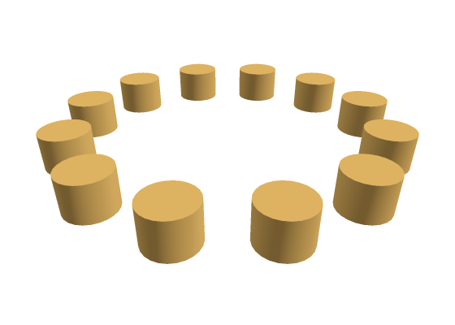

*`cos` gives each post its x, `sin` gives it its y, and twelve of them make a circle.*

**Angles are in degrees**, not radians. `sin(90)` is `1`.

BetterSCAD snaps the exact cases to exact answers: `sin(180)` is `0`, not `1.2e-16`. Without that, float noise spreads into every polygon built from them and turns up later as non-planar faces and failed booleans.

`tan(90)` has no finite value and returns infinity.

See also: [`asin(), acos(), atan(), atan2()`](#entry-asin)

<a id="entry-asin"></a>

### asin(), acos(), atan(), atan2()

```
asin(x) | acos(x) | atan(x) | atan2(y, x)
```

The other direction: given a ratio, these give you back the angle. `atan2` is the one to use when you have an x and a y and want the angle between them.

```scad
echo(asin(0.5), acos(0.5), atan(1), atan2(1, -1));
```

```
ECHO: 30, 60, 45, 135
```

All results are in **degrees**.

`asin` and `acos` need an input between `-1` and `1`; outside that there is no angle and the result is `nan`.

`atan(y / x)` cannot tell which quadrant you are in — it only ever answers between -90 and 90. `atan2(y, x)` takes the two separately and covers the full circle, -180 to 180. Prefer it.

See also: [`sin(), cos(), tan()`](#entry-sin)

<a id="entry-floor"></a>

### floor(), ceil(), round()

```
floor(x) | ceil(x) | round(x)
```

Turn a number with a fraction into a whole number: `floor` always goes down, `ceil` always goes up, `round` goes to whichever is nearer.

```scad
echo(floor(2.7), ceil(2.1), round(2.5), round(-2.5));
```

```
ECHO: 2, 3, 3, -3
```

`floor(-2.5)` is `-3` and `ceil(-2.5)` is `-2`: down and up mean along the number line, not towards or away from zero.

`round()` rounds a half **away from zero**: `round(2.5)` is `3` and `round(-2.5)` is `-3`. This matches OpenSCAD, and differs from JavaScript’s `Math.round`, which would give `-2`.

<a id="entry-pow"></a>

### pow()

```
pow(base, exponent)
```

Multiplies a number by itself a number of times. `pow(2, 10)` is 2 times itself ten times.

```scad
echo(pow(2, 10), 2 ^ 3 ^ 2, -2 ^ 2);
```

```
ECHO: 1024, 512, -4
```

The operator `^` does the same thing: `2 ^ 10`.

`^` binds **tighter than a leading minus**, so `-2 ^ 2` is `-4`, not `4`.

It is right-associative: `2 ^ 3 ^ 2` is `2 ^ (3 ^ 2)`, which is `512`.

A fractional exponent gives a root: `pow(8, 1/3)` is `2`.

See also: [`sqrt()`](#entry-sqrt)

<a id="entry-sqrt"></a>

### sqrt()

```
sqrt(x)
```

The square root: the number that gives you `x` when multiplied by itself. `sqrt(9)` is `3`.

```scad
echo(sqrt(9), sqrt(2));
```

```
ECHO: 3, 1.41421
```

A negative input has no real square root and gives `nan`.

See also: [`pow()`](#entry-pow) · [`norm()`](#entry-norm)

<a id="entry-ln"></a>

### ln(), log(), exp()

```
ln(x) | log(x) | exp(x)
```

Logarithms and their opposite. `log` answers "ten to the what?", `ln` answers the same for the number e, and `exp` goes back the other way.

```scad
echo(ln(1), log(1000), exp(0));
```

```
ECHO: 0, 3, 1
```

`log` is base 10; `ln` is base e (about 2.71828).

`exp(x)` is e to the power x, so `exp(ln(x))` is `x`.

A zero or negative input to `ln` or `log` has no answer: `ln(0)` is `-inf` and `ln(-1)` is `nan`.

<a id="entry-min"></a>

### min(), max()

```
min(a, b, …) | min(vector)
```

The smallest, or the largest, of the numbers you give them.

```scad
echo(min(4, 2, 9), max([4, 2, 9]));
```

```
ECHO: 2, 9
```

Both forms work: several arguments, or one list.

Handy for clamping: `min(max(x, 0), 10)` keeps `x` between 0 and 10.

<a id="entry-norm"></a>

### norm()

```
norm(v)
```

How long a vector is — the straight-line distance from the origin to the point it names.

```scad
echo(norm([3, 4]), norm([1, 2, 2]));
```

```
ECHO: 5, 3
```

Works in any number of dimensions: the square root of the sum of the squares.

For the distance between two points, subtract them first: `norm(b - a)`.

See also: [`cross()`](#entry-cross) · [`sqrt()`](#entry-sqrt)

<a id="entry-cross"></a>

### cross()

```
cross(a, b)
```

Given two directions in 3D, gives a third one at right angles to both. It is how you find which way a surface faces.

```scad
echo(cross([1, 0, 0], [0, 1, 0]));
```

```
ECHO: [0, 0, 1]
```

On two 3D vectors it returns a 3D vector. On two 2D vectors it returns the single number that would be the z component.

The length of the result is the area of the parallelogram the two inputs make, so it is `0` when they point the same way.

Order matters: `cross(a, b)` is the negative of `cross(b, a)`.

See also: [`norm()`](#entry-norm)

<a id="entry-rands"></a>

### rands()

```
rands(min_value, max_value, value_count, seed)
```

Gives you a list of random numbers between two limits. Pass a `seed` and you get the same "random" numbers every time, which is what you want in a model you have to rebuild.

```scad
for (v = rands(0, 30, 6, seed = 42)) translate([v, 0, 0]) cube([2, 8, 8]);
```

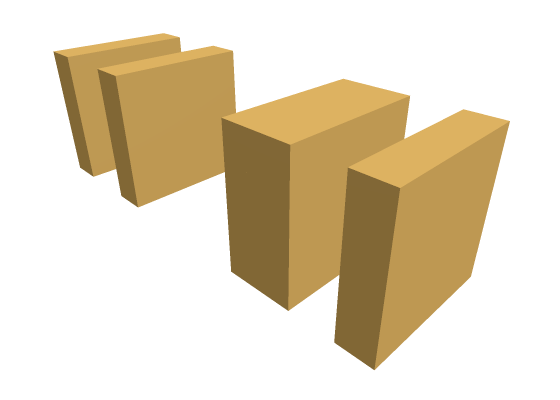

*Six seeded positions — the same six on every render.*

Always returns a **list**, even for one value: `rands(0, 1, 1)[0]`.

Without a seed, every render is different — including the render your export used, which is rarely what you want in a part.

Seeded sequences use mt19937, the same core generator OpenSCAD seeds, so results are reproducible and principled. Exact agreement with OpenSCAD’s own distribution mapping is not claimed.

<a id="entry-pi"></a>

### PI

The number 3.14159…, the one that turns up whenever circles do.

```scad
echo(PI, 1/0, 0/0);
```

```
ECHO: 3.14159, inf, nan
```

**The only built-in constant.** There is no `E`, and no `inf` or `nan` names.

Those values do exist — you produce them arithmetically: `1/0` is `inf`, `-1/0` is `-inf`, `0/0` is `nan`.

`PI` sits below every user scope, so a file may shadow it by assigning to it. Adding `E`, `inf` and `nan` as names would be a language extension, and every BetterSCAD extension has to have a way back to plain `.scad` — these have none, so they are not added.

## Lists and text

Measuring, joining and searching lists and strings.

<a id="entry-len"></a>

### len()

```
len(list | string)
```

How many things are in a list, or how many characters are in a string.

```scad
echo(len([4, 5, 6]), len("hello"));
```

```
ECHO: 3, 5
```

On a number or a boolean it is `undef`, which is a useful way to ask "is this a list?" in older code — though `is_list()` says it better.

Nested lists count only the outer level: `len([[1, 2], [3, 4]])` is `2`.

See also: `is_list`

<a id="entry-concat"></a>

### concat()

```
concat(…)
```

Joins lists end to end into one longer list.

```scad
echo(concat([1, 2], [3, 4], 5));
```

```
ECHO: [1, 2, 3, 4, 5]
```

It flattens **exactly one level**. `concat([1, 2], [3, 4])` is `[1, 2, 3, 4]`, and `concat([[1, 2]], [[3]])` is `[[1, 2], [3]]`.

Values that are not lists are added as single entries: `concat(1, [2, 3])` is `[1, 2, 3]`.

It is the standard way to build a list up in a recursive function.

See also: [`List comprehensions`](#entry-list-comprehension)

<a id="entry-str"></a>

### str()

```
str(…)
```

Turns values into text and sticks them together. It is how you build a label out of a number.

```scad
n = 12;
echo(str("M", n, " bolt"));
```

```
ECHO: "M12 bolt"
```

```scad
size = 16;
linear_extrude(3) text(str(size, " mm"), size = 8, halign = "center");
```

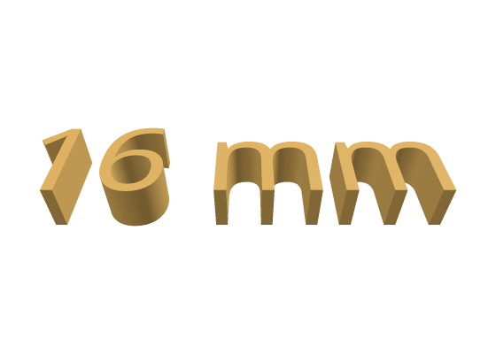

*A number turned into a label and extruded into the part.*

Takes any number of values of any type and joins them with nothing in between.

Numbers print the way `echo` prints them, to six significant figures.

See also: [`text()`](#entry-text) · [`chr(), ord()`](#entry-chr)

<a id="entry-chr"></a>

### chr(), ord()

```
chr(code | list) | ord(string)
```

Convert between a character and its number. Every character has one — `A` is 65 — and these swap between the two.

```scad
echo(chr(65), chr([72, 105]), ord("A"));
```

```
ECHO: "A", "Hi", 65
```

`chr` accepts one code point, or a list of them, and returns a string.

`ord` returns the code point of the **first** character only.

Code points are Unicode, so `chr(8364)` is a euro sign, not a byte.

See also: [`str()`](#entry-str)

<a id="entry-search"></a>

### search()

```
search(match_value, string_or_vector, num_returns_per_match, index_col_num)
```

Finds where something appears in a list or a string, and tells you the position.

```scad
echo(search("b", "abcb"), search([3], [[1], [3], [3]], 0));
```

```
ECHO: [1], [[1, 2]]
```

With the default `num_returns_per_match` of `1`, each needle contributes **at most one** index, and **a miss contributes nothing at all**.

That last part is what makes `search` usable for filtering, and it is also its trap: you cannot compare the length of the result to the length of the needle to detect misses, because a miss simply is not there.

`num_returns_per_match = 0` returns every match for each needle, as a list of lists.

`index_col_num` picks which column of a table of pairs is searched. It defaults to `0`.

See also: [`lookup()`](#entry-lookup) · [`len()`](#entry-len)

<a id="entry-lookup"></a>

### lookup()

```
lookup(key, table)
```

Reads a value out of a table of pairs, and works out an in-between value when your key falls between two rows.

```scad
table = [[0, 10], [10, 20], [20, 60]];
echo(lookup(5, table), lookup(15, table), lookup(99, table));
```

```
ECHO: 15, 40, 60
```

`table` is a list of `[key, value]` pairs. It should be sorted by key.

Between two rows the answer is **interpolated** — halfway between the keys gives halfway between the values. That is the whole point of it, and what makes it different from a plain index.

Outside the table it clamps to the nearest end rather than extrapolating.

See also: [`search()`](#entry-search)

## Checking types

Ask what kind of value something is. Mostly used to give a module sensible behaviour when an argument is left out.

<a id="entry-is_undef"></a>

### is_undef()

```
is_undef(x)
```

`true` when a value is `undef` — the "nothing here" value a variable has when it was never given one.

```scad
module plate(w = 20, h) {
  height = is_undef(h) ? w / 4 : h;
  cube([w, w, height]);
}

plate();
translate([30, 0, 0]) plate(20, 16);
```

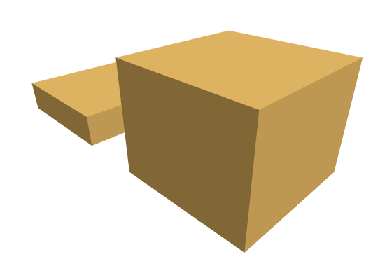

*The left plate works its height out; the right one was told.*

This is the normal way to detect an argument the caller did not pass, when the useful default depends on the other arguments.

An unknown name is `undef` rather than an error, which is why this check is needed at all.

See also: [`is_bool(), is_num(), is_string(), is_list(), is_function()`](#entry-is_num)

<a id="entry-is_num"></a>

### is_bool(), is_num(), is_string(), is_list(), is_function()

```
is_num(x)
```

Each answers `true` or `false` for one kind of value: a true/false, a number, some text, a list, or a function.

```scad
echo(is_num(3), is_string("a"), is_list([1]), is_bool(false), is_function(function (x) x));
```

```
ECHO: true, true, true, true, true
```

`is_num` is `false` for `nan`, which is deliberate — `nan` is a number that no calculation should be trusted with.

`is_list` is `true` for `[]`. Check `len()` as well if empty is not acceptable.

A common pattern is accepting either form of an argument: `size = is_list(s) ? s : [s, s, s]`.

BetterSCAD adds `is_range()` to the set.

See also: [`is_undef()`](#entry-is_undef) · [`is_range()`](#entry-is_range)

<a id="entry-version"></a>

### version(), version_num()

```
version() | version_num()
```

Reports which language version is running — as a list of three numbers, or as one number. Libraries use it to decide what they can rely on.

```scad
echo(version(), version_num());
```

```
ECHO: [2021, 1, 0], 20210100
```

`version()` is `[year, month, day]`; `version_num()` is the same three numbers packed into one, as `yyyymmdd` — so `[2021, 1, 0]` is `20210100`.

BetterSCAD reports the OpenSCAD language version it implements, not its own, because that is the question a library is asking.

## Output and checks

Printing values, stopping on mistakes, and the two leftovers.

<a id="entry-echo"></a>

### echo()

```
echo(…)
```

Prints values to the Console panel. It is how you find out what a number actually is when a shape comes out wrong.

```scad
size = 24;
echo(size, half = size / 2);
```

```
ECHO: 24, half = 12
```

Takes any number of values, of any type, and prints them separated by commas.

Named arguments print as `name = value`, which is the quickest way to label what you are looking at.

It draws nothing, and can be used as an expression: `echo("here") cube(10);` prints and then draws.

See also: [`assert()`](#entry-assert)

<a id="entry-assert"></a>

### assert()

```
assert(condition, message)
```

Checks that something is true and stops with an error if it is not. It turns a silently wrong model into a clear complaint.

```scad
wall  = 3;
bore  = 10;
outer = 17;

assert(outer - bore >= 2 * wall, "wall too thin for this bore");

difference() {
  cylinder(h = 20, d = outer, $fn = 48);
  translate([0, 0, -1]) cylinder(h = 22, d = bore, $fn = 48);
}
```

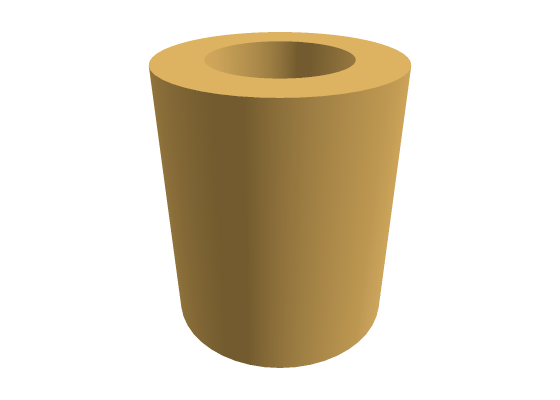

*The check passes, so the part is drawn. Set `bore` to 13 and nothing is drawn at all — you get that message instead.*

The message is optional but worth writing: it is what you will read in six months.

It works as a statement and as an expression, so it can guard a function: `function f(x) = assert(x > 0, "x must be positive") sqrt(x);`.

Use it on a module’s arguments to catch impossible combinations — a wall thickness larger than the part, a count of zero — before they become confusing geometry.

See also: [`echo()`](#entry-echo)

<a id="entry-render"></a>

### render()

```
render(convexity)
```

In OpenSCAD, forces a piece of the model to be worked out properly instead of approximated. BetterSCAD already does that everywhere, so it changes nothing here.

```scad
render() difference() {
  cube(20, center = true);
  sphere(12);
}
```

Accepted so that existing files keep working, and it does pass its children through unchanged.

OpenSCAD needs it because its fast preview uses a different, approximate engine. BetterSCAD computes exact geometry in both preview and render, so there is nothing for `render()` to force.

`convexity` is accepted and ignored for the same reason.

See also: [`$preview`](#entry-preview)

<a id="entry-not-implemented"></a>

### Not implemented

Two functions of OpenSCAD’s are not here. Calling either warns and gives you `undef` rather than failing silently.

```scad
echo(parent_module(0));
```

```
ECHO: undef
```

*Also reports `parent_module() is not a known function` as a warning.*

`parent_module(n)` — the name of the module `n` levels up the call stack. It exists so that a module can behave differently depending on who called it, which is a thing worth being able to do and not a thing worth relying on.

`textmetrics(…)` — the measured size of a string. It is in OpenSCAD’s development snapshots, not in the 2021.01 release BetterSCAD implements.

Third-party libraries (BOSL2, MCAD) are also untested and unsupported. They lean on deep recursion and large list comprehensions; they may well work, and they are not promised to.

`surface()` with an **image** heightmap works in the browser, which has an image decoder, but not in the command-line `bscad`, which reports a clear error rather than pulling an image codec into the engine. `.dat` grids work in both.

See also: [`surface()`](#entry-surface) · [`version(), version_num()`](#entry-version)

<a id="entry-assign"></a>

### assign()

```
assign(name = value) …
```

The old way of naming a value for one statement. `let()` replaced it years ago; it is here so that old files still open.

```scad
assign(r = 12) cylinder(h = 20, r = r);
```

Behaves like `let()`. Prefer `let()` in anything new.

Unlike `let()`, it cannot be used as an expression.

See also: [`let()`](#entry-let)

---

# BetterSCAD additions

What BetterSCAD adds on top, under one rule: every addition has a defined way back to plain `.scad`. Each entry says what it becomes when you save as OpenSCAD.

## Shapes

Four shapes you would otherwise build by hand every time.

<a id="entry-shape-radius"></a>

### cube(r), square(r)

```
cube(size, center, r) | square(size, center, r)
```

A box or a rectangle with its edges eased off. It is the same `cube()` and `square()` you already use, with one more number on the end for how round the edges are.

```scad
cube([44, 30, 16], r = 4, $fn = 32);
```

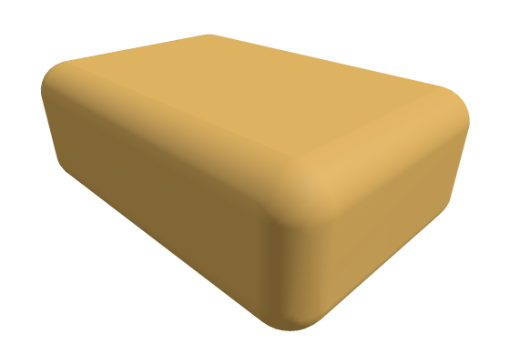

*Every edge and corner rounded to a radius of 4.*

```scad
linear_extrude(height = 16) square([44, 30], r = 6);
```

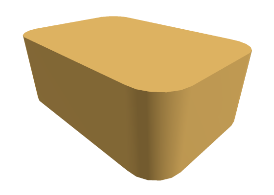

*Extruding a rounded square instead rounds the sides but leaves the top flat.*

```scad
square([44, 28], r = 8);
```

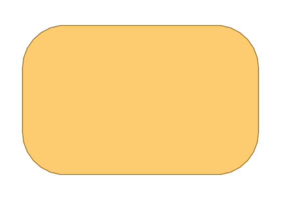

*The 2D form: a 44 x 28 rectangle with corners of radius 8.*

```scad
square(30, r = 15);
```


*At exactly half the shortest side the corners meet: a stadium.*

| Argument | |
| --- | --- |
| `size` | As always: a number, or `[x, y]` / `[x, y, z]`. |
| `center` | `true` centres it on the origin. Default `false`. |
| `r` | Edge radius, clamped to half the shortest side. Default `0`. |

`r` is the radius. Leave it out, or set it to `0`, and you have the stock primitive — the file exports byte for byte, and nothing is reported as an extension. It is only a BetterSCAD file once you actually round something.

**`r` comes after `center`, not before it.** `cube(10, true)` has meant one thing since OpenSCAD was written and still does; the radius takes the third slot. Named arguments — `cube(10, r = 2)` — sidestep the question entirely and are what you should write.

It is clamped to half the shortest side, with a warning: past that there is no straight section left to round. At exactly half, a square becomes a stadium and a cube a capsule.

`cube(r = …)` rounds **every** edge, not just the vertical ones. For a box with rounded sides and a flat top, extrude a rounded square instead — the second example below.

Both are built as the hull of their corner primitives, which **is** the Minkowski sum of the box and a disc or sphere, without the cost of computing one. The rounding follows `$fn`/`$fa`/`$fs` as usual.

**Saved as OpenSCAD `.scad`:** With no `r`, nothing — the call is already stock. With one, a generated module using the same hull of corner circles or spheres, defined once however many times it is used.

See also: [`cube()`](#entry-cube) · [`square()`](#entry-square) · [`cylinder(fillet)`](#entry-cylinder-fillet) · [`offset()`](#entry-offset) · [`hull()`](#entry-hull) · [`minkowski()`](#entry-minkowski)

<a id="entry-cylinder-fillet"></a>

### cylinder(fillet)

```
cylinder(…, fillet, fillet1, fillet2, fillet_style)
```

Takes the sharp rim off the end of a cylinder — rounded like a worn edge, or cut flat like a chamfer. `fillet` does both ends; `fillet1` is the bottom and `fillet2` the top.

```scad
cylinder(h = 24, r = 10, fillet = 3, $fn = 64);
```

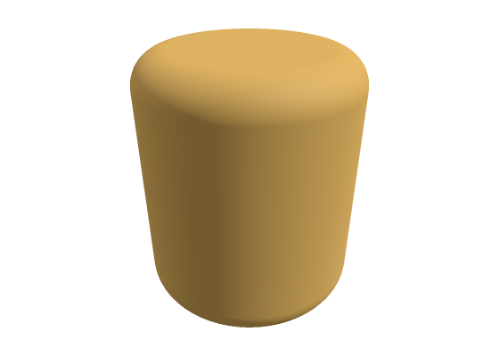

*Both ends rounded by 3.*

```scad
cylinder(h = 24, r = 10, fillet2 = 6, $fn = 64);
```

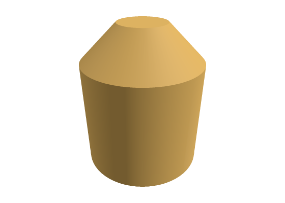

*`fillet2` is the top only — 2 is the top, as it is for `r2`.*

```scad
cylinder(h = 24, r = 10, fillet = 3, fillet_style = "chamfer", $fn = 64);
```

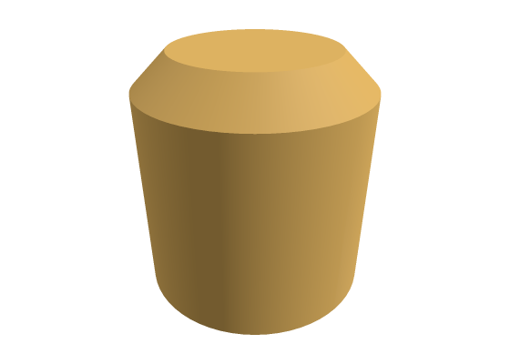

*The same 3, cut flat instead of rounded.*

```scad
cylinder(h = 24, r1 = 14, r2 = 6, fillet = 2.5, $fn = 64);
```

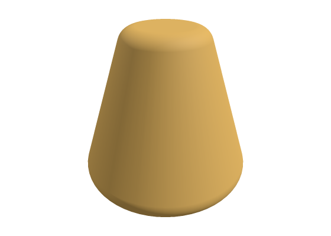

*On a taper the corner is not square, and the arc is solved for the real angle.*

| Argument | |
| --- | --- |
| `fillet` | Radius at both ends. Default `0`. |
| `fillet1` | Bottom end, overriding `fillet`. |
| `fillet2` | Top end, overriding `fillet`. |
| `fillet_style` | `"round"` (default) or `"chamfer"`. |

`fillet1` and `fillet2` are numbered the same way round as `r1` and `r2`: **1 is the bottom, 2 is the top.** Either overrides `fillet` for its own end, exactly as `r1` overrides `r`. There is one convention on this module for "both, or each", and this is it.

`fillet_style` is `"round"` (the default) — a true arc, tangent to both the wall and the face — or `"chamfer"`, a straight cut across the same two points. They are one argument rather than two shapes because they are the same construction: the chamfer is the chord of the fillet.

It works on a cone as well as a straight cylinder. On a taper the corner is not a right angle, so the arc that meets both edges is not a quarter circle — the profile is solved for the actual angle rather than assumed.

A fillet larger than the end it is easing is clamped to fit, with a warning.

With no fillet this is the stock primitive: it exports byte for byte and is not reported as an extension. `fillet = 0` is the same shape as leaving it out, not a revolve that merely measures the same.

**Saved as OpenSCAD `.scad`:** With no fillet, nothing — the call is already stock. With one, a generated module that revolves the same profile, defined once however many times it is used.

See also: [`cylinder()`](#entry-cylinder) · [`cube(r), square(r)`](#entry-shape-radius) · [`rotate_extrude()`](#entry-rotate_extrude) · [`minkowski()`](#entry-minkowski)

<a id="entry-regular_polygon"></a>

### regular_polygon()

```
regular_polygon(sides, length)
```

A flat shape with any number of equal sides — a hexagon, a pentagon — described the way you would measure one: by how long a side is.

```scad
regular_polygon(6, 20);
```

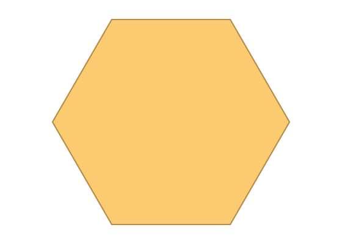

*A hexagon whose every side is exactly 20 long.*

```scad
linear_extrude(6) regular_polygon(5, 18);
```

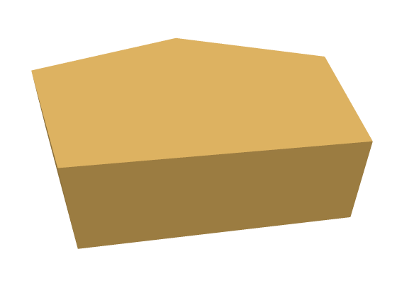

*A pentagon, extruded.*

| Argument | |
| --- | --- |
| `sides` | Number of sides. Three or more. |
| `length` | Length of one side. Greater than zero. |

`circle($fn = 6)` already gives a hexagon, but you have to work out the radius that produces the side length you actually want. This does that arithmetic for you.

The circumradius used is `length / (2 * sin(180 / sides))`.

Fewer than three sides cannot close a shape, and a side length of zero or less has no shape to describe. Both are errors rather than an empty result.

The polygon is centred on the origin, with a vertex on the +X axis.

**Saved as OpenSCAD `.scad`:** A generated module wrapping `circle($fn = sides)` at the matching circumradius.

See also: [`circle()`](#entry-circle) · [`polygon()`](#entry-polygon) · [`$fn`](#entry-fn)

<a id="entry-thread"></a>

### thread()

```
thread(d, pitch, h, internal, clearance, angle, chamfer, center, segments)
```

A screw thread. Give it the diameter of the bolt, how far one turn advances, and how long it should be. Add `internal = true` and you get the hole that same bolt screws into — the two are made to fit.

```scad
thread(d = 8, pitch = 1.25, h = 10, $fn = 48);
```

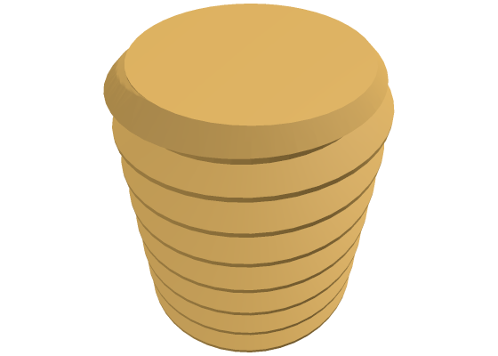

*An M8 threaded rod: `d = 8` across the crests, advancing 1.25 per turn. Both ends taper so the first turn runs out rather than ending in a knife edge.*

```scad
difference() {
  cylinder(h = 7, r = 7.5, $fn = 6);
  thread(d = 8, pitch = 1.25, h = 7, internal = true, $fn = 48);
}
```

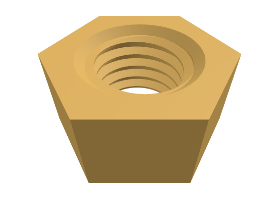

*The same numbers with `internal = true`, subtracted from a hex blank: a nut the rod above screws into.*

```scad
union() {
  cylinder(h = 6, r = 9, $fn = 48);
  negative() thread(d = 8, pitch = 1.25, h = 6, internal = true, $fn = 48);
}
```

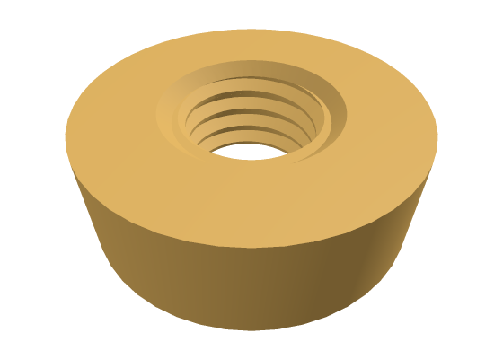

*Written with `negative()` instead, so the threaded hole sits next to the thing it goes through.*

| Argument | |
| --- | --- |
| `d` | Outside diameter, across the crests. |
| `pitch` | How far one turn advances. |
| `h` | Length of the threaded section. |
| `internal` | `true` builds the solid to subtract for a matching hole. Default `false`. |
| `clearance` | Fit between the pair, applied to the internal thread only. Default `0.2`. |
| `angle` | Included angle of the tooth. Default `60`. |
| `chamfer` | Shape the ends — taper outside, countersink inside. Default `true`. |
| `center` | `true` centres it on the origin. Default `false`. |
| `segments` | Facets per turn. Defaults from `$fn`, floored at 24. |

`d` is the outside diameter, measured across the crests, and `pitch` is how far the thread advances in one turn. A common M8 bolt is `d = 8, pitch = 1.25`. Both are ordinary numbers; there is no table of standard sizes to look a name up in.

The thread is right-handed, single start, and sits on a solid core, so `thread()` on its own is already a threaded rod — there is nothing to add a shaft to.

`internal = true` is the whole mating story. It builds the **solid to subtract**, not the nut: put it under `negative()` or in a `difference()` and what is left is a hole the matching bolt turns into.

`clearance` (default `0.2`) is the gap between the pair, and only the internal thread grows by it — a bolt always measures the `d` you asked for. Raise it for a looser fit or a printer that runs wide; `0` gives a geometrically exact pair, which will not assemble in any real material.

The clearance is uniform, not merely radial: the female groove is wider across the flanks as well as deeper, which is what actually lets the two turn against each other.

Both are the same construction with one number changed, so a bolt and its hole cannot drift apart. Anything true of one is true of the other.

`chamfer` (default `true`) shapes the ends. External threads taper in, so the first turn runs out instead of ending in a knife edge that will not print. Internal ones flare out into a countersink, which is what lets a bolt start square rather than cross-threading. Set it `false` for a thread that continues into adjoining geometry.

`angle` (default `60`) is the included angle of the tooth. 60 is the ISO metric profile; 29 is roughly an Acme leadscrew. The crest and root truncations follow ISO proportions at any angle.

`center` behaves as it does for `cylinder()`. `segments` is the number of facets per turn; it follows `$fn`/`$fa`/`$fs` but never drops below 24, because a coarse circle is merely faceted while a coarse helix stops being a thread at all.

A thread is a lot of geometry — a turn of facets for every turn of the helix. A long, fine-pitched, high-`$fn` thread says so in a warning rather than just going slow.

A pitch too coarse for the diameter, or a clearance so large the groove closes up, are errors rather than a shape that is quietly not a thread.

**Saved as OpenSCAD `.scad`:** A generated module sweeping the same profile up the same twisted extrusion, defined once however many times it is used.

See also: [`negative()`](#entry-negative) · [`cylinder()`](#entry-cylinder) · [`difference()`](#entry-difference) · [`regular_polygon()`](#entry-regular_polygon) · [`$fn`](#entry-fn)

## Negative space

Write a hole where the hole is, instead of hoisting it to the top of the file.

<a id="entry-negative"></a>

### negative()

```
negative() { … }
```

Turns whatever is inside it into a hole instead of material. The hole is cut out of everything else nearby, so you can write it right next to the thing it goes through.

```scad
union() {
  cylinder(h = 8, r = 26, $fn = 64);
  cylinder(h = 22, r = 10, $fn = 48);

  negative() {
    translate([0, 0, -1]) cylinder(h = 30, r = 5, $fn = 40);
    for (i = [0 : 4])
      rotate([0, 0, i * 72]) translate([18, 0, -1]) cylinder(h = 10, r = 2.5, $fn = 24);
  }
}
```

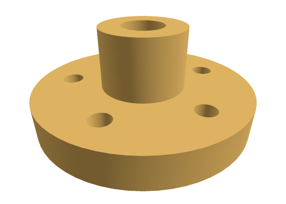

*One `negative()` block cuts both the plate and the boss above it.*

```scad
cube([40, 40, 10]);
translate([20, 20, -1]) negative() cylinder(h = 12, r = 8, $fn = 40);
```

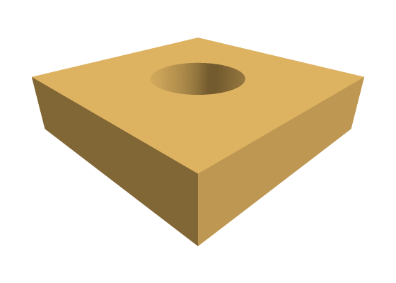

*The negative is written under a `translate`, which is not a scope — so it rides up to the top level, keeping the transform, and cuts the cube.*

With `difference()`, the material has to come first and every hole has to be collected after it. In a model of any size that means the hole ends up a long way from the part it belongs to. `negative()` lets you write it in place.

**Its reach is the enclosing braces** — the `{ … }` block, module body, or top level it is written in. Never further. It is global only when written at the top level.

Wrappers that are not scopes are transparent to it: `translate`, `rotate`, `color`, `if`, `for` and `let` pass a negative through to the enclosing scope, carrying their transforms with it. So `translate([5, 0, 0]) negative() cube(10)` and `negative() translate([5, 0, 0]) cube(10)` cut identically.

Adding braces makes a wrapper a scope, which contains the negative: `translate([5, 0, 0]) { negative() cube(10); }` cuts nothing, and warns.

A module body is always a scope, braced or not, so a `negative()` inside a module can never reach out and cut its caller.

A negative that reaches its scope with nothing to cut produces no geometry, and reports a warning.

**Saved as OpenSCAD `.scad`:** The enclosing scope is rewritten as `difference() { union() { …siblings… } …negatives… }`, with each cutter keeping the wrappers it was written under. The geometry is identical, and the round trip is covered by tests for every nesting case above.

See also: [`difference()`](#entry-difference) · [`% (ghost)`](#entry-background) · [`# (highlight)`](#entry-highlight)

## Transforms without the brackets

The same three transforms, written the way you would say them out loud.

<a id="entry-loose-numbers"></a>

### translate(x, y, z)

```
translate(x, y, z) | rotate(x, y, z) | mirror(x, y, z)
```

Write the numbers straight into the brackets instead of wrapping them in a list. `translate(10, 5, 2)` means the same as `translate([10, 5, 2])`.

```scad
%cube(20);
translate(30, 10, 5) cube(20);
```

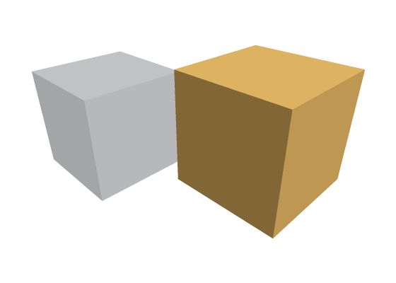

*The same move as `translate([30, 10, 5])`, with two fewer brackets.*

Available on `translate`, `rotate` and `mirror`.

A missing third number is `0`, so `translate(10, 5)` moves in X and Y only.

**Stock spellings are untouched.** `rotate(a, v)` is still the axis rotation it always was, and a single argument still means what it always did — the loose form only applies from the second argument onwards.

**Saved as OpenSCAD `.scad`:** The numbers are collected back into a vector. Exact.

See also: [`translate()`](#entry-translate) · [`rotate()`](#entry-rotate) · [`mirror()`](#entry-mirror) · [`translatex(), translatey(), translatez()`](#entry-translatex)

<a id="entry-translatex"></a>

### translatex(), translatey(), translatez()

```
translatex(d) | translatey(d) | translatez(d)
```

Move along one axis, with the axis in the name. `translatez(10)` lifts something ten units up — no counting commas to check which slot is which.

```scad
%cube(20);
translatez(28) cube(20);
```

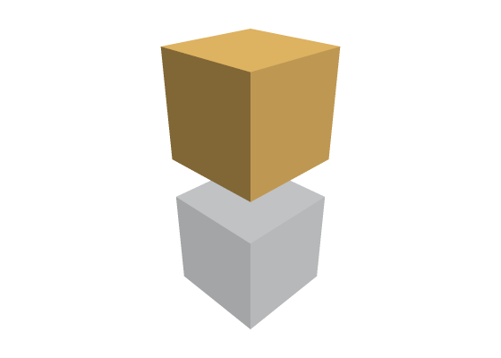

*Straight up, with the axis named rather than counted.*

| Argument | |
| --- | --- |
| `d` | Distance along that axis. |

Exactly equivalent to the matching `translate()` call, and stackable with everything else.

The gain is at reading time, not writing time: `translatez(-1)` on a cutter says "poke it through the bottom" in a way `translate([0, 0, -1])` does not.

**Saved as OpenSCAD `.scad`:** `translatex(d)` becomes `translate([d, 0, 0])`, and likewise for Y and Z. Exact, and rewritten in place rather than via a module.

See also: [`translate()`](#entry-translate) · [`rotatex(), rotatey(), rotatez()`](#entry-rotatex) · [`mirrorx(), mirrory(), mirrorz()`](#entry-mirrorx)

<a id="entry-rotatex"></a>

### rotatex(), rotatey(), rotatez()

```
rotatex(a) | rotatey(a) | rotatez(a)
```

Turn about one axis, with the axis in the name. `rotatez(90)` spins something a quarter turn about the vertical axis.

```scad
%cylinder(h = 30, r = 6, $fn = 32);
rotatex(90) cylinder(h = 30, r = 6, $fn = 32);
```

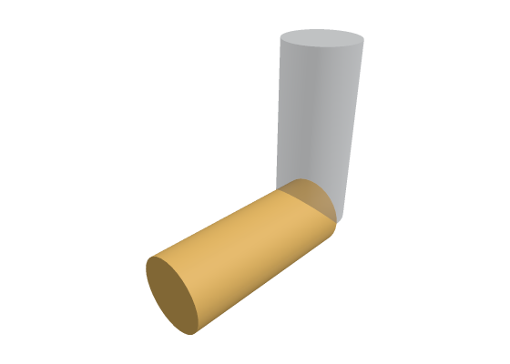

*The ghost stands up; `rotatex(90)` lays the same cylinder down.*

| Argument | |
| --- | --- |
| `a` | Degrees about that axis. |

The angle is in degrees, and the rotation is about the origin — the same as `rotate()`.

Equivalent to `rotate()` with zeros in the other two slots.

**Saved as OpenSCAD `.scad`:** `rotatex(a)` becomes `rotate([a, 0, 0])`, and likewise for Y and Z. Exact.

See also: [`rotate()`](#entry-rotate) · [`translatex(), translatey(), translatez()`](#entry-translatex) · [`mirrorx(), mirrory(), mirrorz()`](#entry-mirrorx)

<a id="entry-mirrorx"></a>

### mirrorx(), mirrory(), mirrorz()

```
mirrorx() | mirrory() | mirrorz()
```

Flip across one plane, with the plane in the name. They take no argument at all, because a mirror is a plane, not a distance.

```scad
module bracket() {
  cube([26, 8, 6]);
  cube([8, 8, 22]);
}

bracket();
mirrorx() bracket();
```

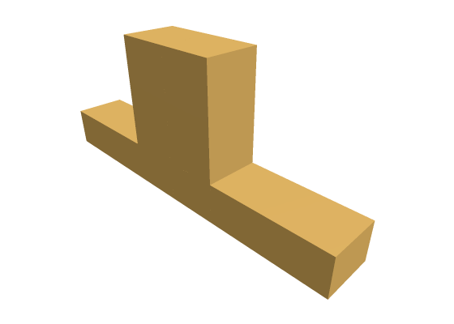

*One bracket definition, drawn plain and mirrored, making a symmetric pair.*

`mirrorx()` flips across the YZ plane — the one facing along X — so left and right swap. `mirrory()` swaps front and back, `mirrorz()` top and bottom.

As with `mirror()`, the original is not kept. Write the part twice for both halves.

**Saved as OpenSCAD `.scad`:** `mirrorx()` becomes `mirror([1, 0, 0])`, and likewise for Y and Z. Exact.

See also: [`mirror()`](#entry-mirror) · [`translatex(), translatey(), translatez()`](#entry-translatex) · [`rotatex(), rotatey(), rotatez()`](#entry-rotatex)

## Language

Two small additions to the language itself.

<a id="entry-c-style-for"></a>

### C-style for

```
for (i = start; condition; i = next) …
```

The kind of loop most programming languages use — start here, keep going while this is true, change it like this each time — usable as a statement, not only inside a list.

```scad
for (d = 4; d < 40; d = d * 1.6)
  translate([d * 3, 0, 0]) cylinder(h = 6, d = d, $fn = 32);
```

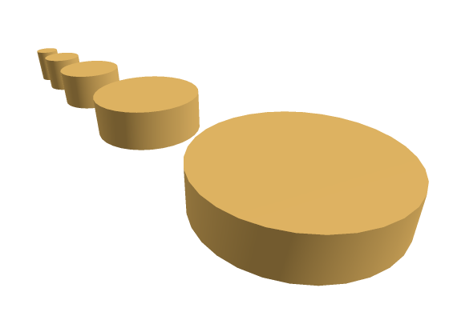

*A step that multiplies rather than adds — awkward to write as a range.*

Stock OpenSCAD allows this form only inside a list comprehension. BetterSCAD also accepts it as a statement, so a loop whose step is not a fixed interval does not have to be rewritten as a range.

It is the natural way to write a loop that doubles, halves, or advances by a computed amount.

Capped at 1,000,000 iterations, which reports a clear error rather than hanging the tab.

**Saved as OpenSCAD `.scad`:** Rewritten as a bounded range `for` with the condition kept as a guard, and the original preserved in a comment. This is exact only for the common `i = start; i < limit; i = i + step` shape, so the export reports it.

See also: [`for`](#entry-for) · [`List comprehensions`](#entry-list-comprehension)

<a id="entry-is_range"></a>

### is_range()

```
is_range(x)
```

`true` when a value is a range like `[0 : 10]`. It fills the one gap in OpenSCAD’s set of type checks.

```scad
echo(is_range([0 : 10]), is_range([0, 1, 2]), is_list([0 : 10]));
```

```
ECHO: true, false, false
```

Every other type has an `is_*` function; ranges did not, so a module that accepts either a range or a list had no way to tell them apart.

**This is the one extension with no way back to plain `.scad`.** A call is left exactly as written on export, and evaluates to `undef` in stock OpenSCAD — and you are *not* warned about it, because there is no rewrite to describe. Avoid it in files you intend to share.

**Saved as OpenSCAD `.scad`:** None. The call is left as written and becomes `undef` in stock OpenSCAD. This is the single exception to the downgrade rule, and is called out wherever it appears.

See also: [`is_bool(), is_num(), is_string(), is_list(), is_function()`](#entry-is_num) · [`for`](#entry-for)

## Getting back to plain OpenSCAD

What happens to all of the above when you save a file for someone else.

<a id="entry-downgrade"></a>

### Save as OpenSCAD .scad

Everything on this page can be written back out as ordinary OpenSCAD. The app rewrites it for you, shows you exactly which lines will change first, and a file that needs no changes is saved byte for byte.

```scad
translatez(10) rotatez(45) cube([30, 20, 8], r = 3);
```

*Written in BetterSCAD…*

```scad
module __rounded_cube(size, center = false, r = 0) {
  hull() for (x = [r, size[0] - r], y = [r, size[1] - r], z = [r, size[2] - r])
    translate([x, y, z]) sphere(r = r);
}

translate([0, 0, 10]) rotate([0, 0, 45]) __rounded_cube([30, 20, 8], r = 3);
```

*…and the same file saved as stock `.scad`.*

It lives in the **Save** menu, and is offered whatever the file’s extension is: a `.scad` that uses extensions is exactly the case where the guarantee is worth having and the file name does not give it away.

Two rules govern what comes out. A one-liner is rewritten in place — `translatez(4)` becomes `translate([0, 0, 4])` on the spot. Anything larger becomes a **generated module**, named `__<shape>`, defined once however many times it is used, so the exported file keeps the shape of the file that produced it.

A generated name that the source already declares gets a numbered suffix rather than shadowing it.

`is_range()` is the single exception, and says so in its own entry.

On the command line: `bscad model.bscad --legacy-scad -o out.scad`.

See also: [`The .bscad file`](#entry-bscad-format)

<a id="entry-bscad-format"></a>

### The .bscad file

BetterSCAD’s own file type — which is also just a `.scad` file. The extra bits it keeps live in a comment at the top, so OpenSCAD opens it without noticing.

The leading comment holds the panel layout, the Customizer presets and the camera position. Everything below it is ordinary source.

Saving follows the extension: a `.bscad` keeps its extras, a `.scad` is written as plain source. Neither changes the geometry.

Opening a `.scad` that uses any of the extensions above warns you, and names the lines.

See also: [`Save as OpenSCAD .scad`](#entry-downgrade)
